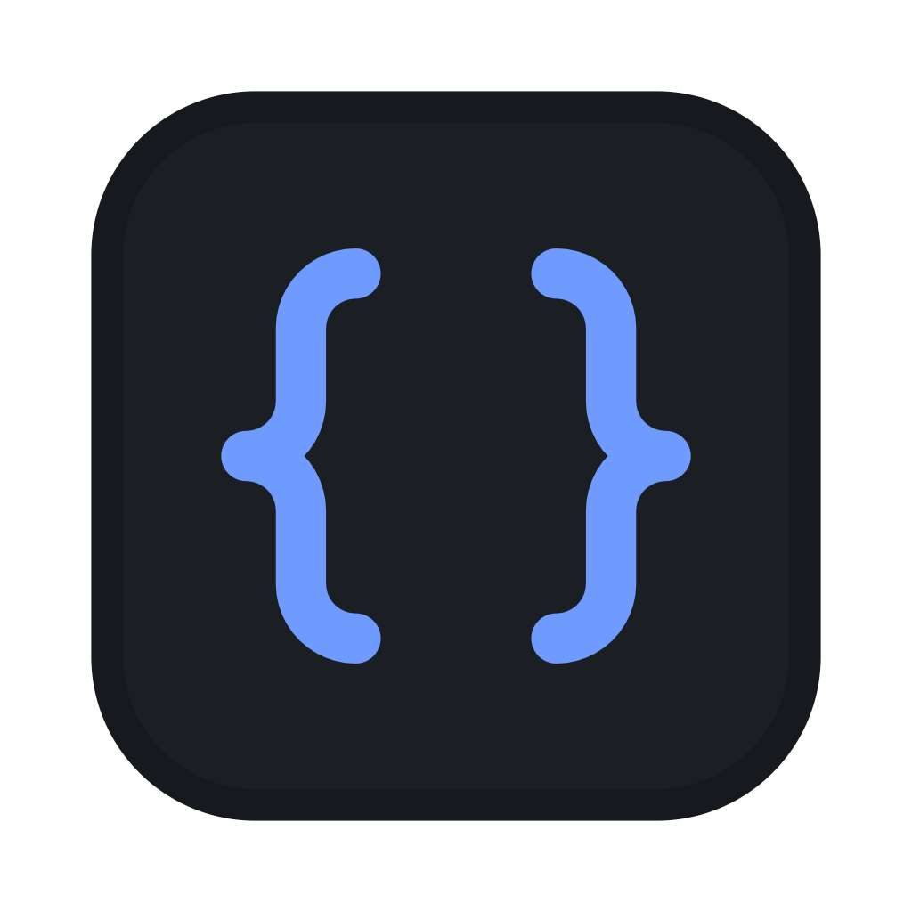
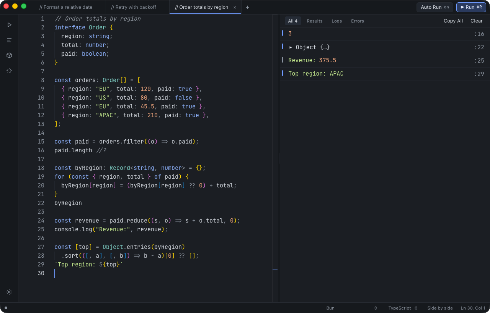
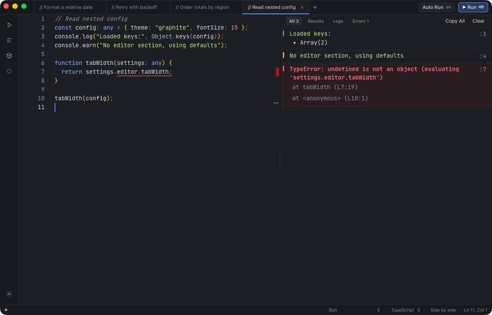
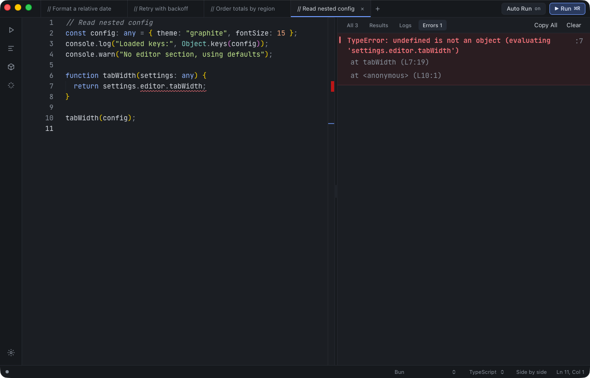
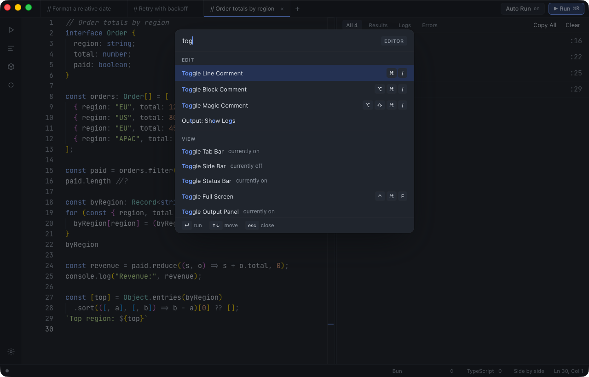
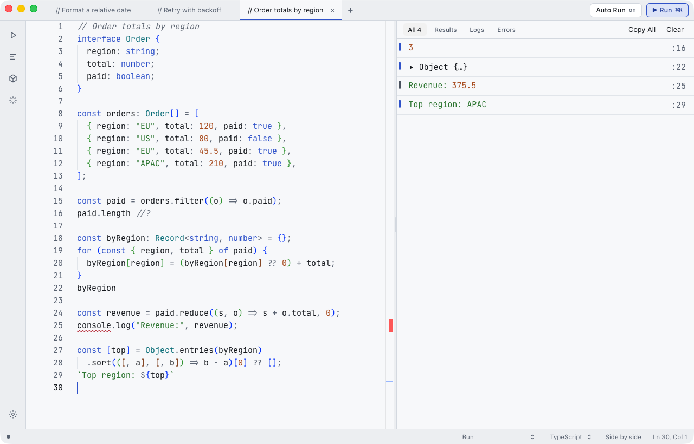
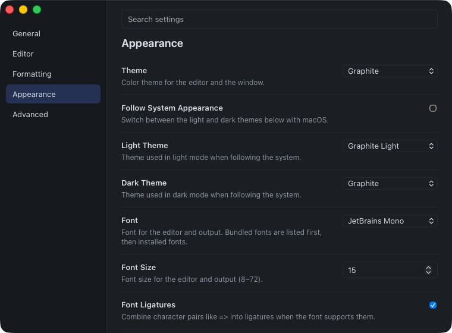

<div align="center">

#  JSLab

**A fast, native JavaScript & TypeScript scratchpad for macOS**

[](https://github.com/GustavoGomez092/js-lab/actions/workflows/ci.yml)
[](https://github.com/GustavoGomez092/js-lab/actions/workflows/release.yml)
[](https://github.com/GustavoGomez092/js-lab/releases)
[](LICENSE)
[](#download)



</div>

Write JavaScript or TypeScript and watch it run as you type. Each result, log and error appears beside the line that produced it. There's no project to set up and no build step: open a tab and start typing.

> JSLab is under active development. Milestones M0–M4 (the core scratchpad, the workspace, language & packages, and browser runtimes) are complete; productivity features and signed releases are next. See the [roadmap](#roadmap).

## Why JSLab

- **Instant results.** Auto Run executes your code a moment after you stop typing, and <kbd>⌘R</kbd> runs it on demand.
- **Line-anchored output.** Every value is tagged with its source line. Click a row to jump to that line.
- **Runs on Bun.** Your code runs in a separate Bun process, so an infinite loop or a crash never takes the editor down with it.
- **Open source, MIT.** Every feature is free. No account, no license key.
- **Your code stays local.** No telemetry and no crash-reporting services. Tabs are saved on your Mac.

## Features

### Editor and live output

- A Monaco editor with TypeScript, JavaScript, TSX and JSX modes, bracket matching, folding, multi-cursor editing and optional Vim keys.
- **Auto Log** shows the value of each top-level expression without a `console.log`.
- **Magic comments** log exactly what you ask for: `value //?`, inline `/*?*/`, or `//? $.length` to log an expression of the value. <kbd>⌘⌥⇧/</kbd> toggles one on the current line.
- **Loop protection** stops runaway `for`, `while`, `do…while`, `for…in` and `for…of` loops before they hang a run.
- **Stop** (<kbd>⌘⇧R</kbd>) and **Kill** (<kbd>⌘⌥R</kbd>), plus a Tab Unresponsive prompt when user code stops answering.
- Zoom (<kbd>⌘=</kbd> / <kbd>⌘−</kbd> / <kbd>⌘0</kbd>) scales the editor, output and window chrome together.

### Output



- Filter chips for **All**, **Results**, **Logs** and **Errors**, each with a live count.
- Errors are tinted, marked in the editor, and show stack frames mapped back to your lines.
- Objects and arrays expand on click, one level at a time.
- A syntax error keeps the last successful output on screen, dimmed and labeled, instead of clearing it.
- Output is bounded: very large logs are truncated, so a million-character string can't freeze the window.
- **Copy All** copies the entries the current filter shows.



### Browser runtimes and the web view

Each tab picks a runtime. **Bun** (the default) runs your code in a real Bun process with the full Node API surface. **Browser** runs it in a WebKit page, and **Browser & Node APIs** gives you that page plus a Node compatibility layer — `fs/promises`, `child_process` and a CORS-free `fetch`, bridged out to JSLab.

- Browser tabs render into a **Web View** tile beside the console: toggle it with <kbd>⌥⌘W</kbd>, View → Web View, or the status bar. The tile is per tab and comes back after a relaunch.
- `document`, `canvas` and `requestAnimationFrame` work, so canvas animation, React, Three.js and Web Audio all run as they would in a browser. Packages you install are bundled into the page for you.
- Logging a page element shows its opening tag, attributes and child count, and expands to its markup.
- A tab playing audio shows a speaker icon; click it to mute that tab.

See [Bun vs Node](docs/user/bun-vs-node.md) for what differs between the three.

### Command palette



Press <kbd>⌘⇧P</kbd> to search every command. Matches are highlighted, results are grouped by section, toggles show whether they are currently on, and each command shows its shortcut.

### Tabs and files

- Multiple tabs: <kbd>⌘T</kbd> for a new one, <kbd>⌘1</kbd>–<kbd>⌘9</kbd> to jump, drag to reorder, and reopen closed tabs. Rename, Close Others and Close to the Right live in the tab's context menu.
- Scratch tabs are titled from their first line; saved tabs use the file name.
- Open (<kbd>⌘O</kbd>) and Save As for `.js`, `.jsx`, `.ts`, `.tsx`, `.mjs`, `.cjs`, `.mts`, `.cts`, `.json` and `.txt` files, or drop files onto the window.
- An unsaved-changes prompt on close, and a confirmation before opening or pasting more than 5 MB.
- **Session restore:** tabs, their code, per-tab layout, folds, cursor and scroll position, and the window's size and display all come back after a relaunch.

### Themes



JSLab ships **Graphite**, a dark native theme, and **Graphite Light**, and can follow the macOS appearance. Other built-in themes include Dracula, One Dark, Monokai, Material Darker, Ayu Dark, Ayu Mirage, SynthWave '84, Shades of Purple, Nord, Night Owl, Catppuccin Mocha, GitHub Dark, Solarized Dark, Tomorrow Night, GitHub Light, Solarized Light, Catppuccin Latte, Ayu Light and Visual Studio Light.

### Formatting

Prettier formats the current tab with <kbd>⌥⇧F</kbd> in a single undo step, keeping folds and scroll position. Turn on **Format on Run** or **Format on Save**, and set print width, quotes, semicolons, trailing commas and more under Settings → Formatting.

### Settings



<kbd>⌘,</kbd> opens a searchable Settings window with General, Editor, Formatting, Appearance and Advanced tabs. Every field has help text, and changes apply live. The font picker lists six bundled coding fonts (JetBrains Mono, Fira Code, DejaVu Sans Mono, Hack, Ubuntu Mono and Source Code Pro), then your installed fonts.

The Help menu can copy a redacted debug log, open the logs folder, or restart JSLab in Safe Mode.

## Download

Download the latest `.dmg` from [GitHub Releases](https://github.com/GustavoGomez092/js-lab/releases), open it and drag JSLab to Applications. Canary builds are published automatically as prereleases on every push to `main`.

> [!IMPORTANT]
> Builds are **not signed or notarized yet**, so macOS blocks the first launch. To open JSLab anyway, Control-click the app in Applications, choose **Open**, and confirm. Or run this once:
>
> ```bash
> xattr -dr com.apple.quarantine "/Applications/JSLab-canary.app"
> ```
>
> The first launch unpacks the app, which can take a few seconds.

JSLab runs on **Apple Silicon Macs only** for now.

## Build from source

**Prerequisites**

- macOS on Apple Silicon.
- [Bun](https://bun.sh) 1.3.13 or newer.
- [Hutch](https://github.com/blackboardsh/hutch) **0.24.3**, which provides the pinned Electrobun 2.0.1 toolchain. Its installer adds a `PATH` line for `~/.hutch/bin` to your shell profile. Don't run `hutch upgrade`: the toolchain is pinned to 0.24.3.

```bash
bun install                          # also fetches the pinned Electrobun devkit through Hutch
cd apps/desktop
hutch run dev                        # build and launch a development copy
hutch run build                      # build the canary app and .dmg into apps/desktop/artifacts
```

## Development

```text
apps/desktop       Electrobun main process (Bun): windows, menus, files, runs, settings
apps/ui            React + Monaco UI for the main and Settings windows
packages/transform     Babel instrumentation: Auto Log, magic comments, loop protection
packages/runner-bun    The Bun process that runs user code
packages/runner-web    The page that runs user code in the browser runtimes
packages/serializer    Encodes values for the output panel
packages/rpc-schema    Typed, validated messages between the processes
packages/shared        Settings, session, commands and keybindings
packages/themes        Built-in themes
packages/e2e           End-to-end harness and scenarios
```

```bash
bun run lint         # Biome
bun run typecheck    # TypeScript, every package
bun run test         # unit and integration tests
bun run e2e          # end-to-end scenarios against a dev build
```

`bun run e2e` needs a dev build (`cd apps/desktop && hutch run build:dev`) and a logged-in macOS GUI session. The harness in `packages/e2e` launches JSLab with a private temporary data folder and drives it over a local socket.

> [!IMPORTANT]
> **`bun run e2e` does not build.** It drives whatever bundle is already on disk, so build first or you are testing old code — a stale bundle fails fast and confidently for reasons that have nothing to do with your change. Read the failure text, not the timings.

`bun run readme:screenshots` regenerates the images in `docs/images/` through the same harness. Captures are window-only and need Screen Recording access for the JSLab dev app (System Settings → Privacy & Security → Screen Recording); the script never requests it.

Scripted launches must use a working directory on an internal disk. From an external volume, macOS asks for removable-volume access, and a background launch can't show that prompt. The E2E harness handles this for you.

## Roadmap

| Milestone | Scope | Status |
|---|---|---|
| M0 | Spikes: architecture risks retired | ✅ Done |
| M1 | Core scratchpad: live results, console output, errors, recoverable hangs | ✅ Done |
| M2 | Workspace: tabs, files, settings, themes, formatting, command palette | ✅ Done |
| M3 | Language & packages: npm, types and autocomplete, working directory, env vars | ✅ Done (manual QA items pending user) |
| M4 | Browser runtimes: DOM, canvas, React and a live web view | ✅ Done (manual QA items pending user) |
| M5 | Productivity: logpoints UI, snippets, AI chat, Gist, `jslab` CLI | Planned |
| M6 | Ship: signing, notarization, auto-update, 1.0 | Planned |

Details are in the [roadmap](docs/superpowers/plans/2026-09-12-jslab-roadmap.md).

## Docs

- [Design specification](docs/superpowers/specs/2026-09-12-jslab-design.md)
- [Feature parity checklist](docs/parity.md)
- [M2 manual QA checklist](docs/qa/m2-checklist.md)
- [Bun vs Node differences](docs/user/bun-vs-node.md)
- [M3 manual QA checklist](docs/qa/m3-checklist.md)
- [M4 manual QA checklist](docs/qa/m4-checklist.md)

## License

JSLab is released under the [MIT License](LICENSE).

JSLab is an independent, clean-room project. It isn't affiliated with or endorsed by RunJS, and it contains no RunJS code or assets.
