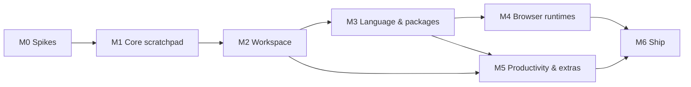

# JSLab v1 Roadmap

> **For agentic workers:** This is the milestone index, not an executable plan. Each milestone gets its own detailed plan in `docs/superpowers/plans/` when it starts. Execute those with superpowers:subagent-driven-development (recommended) or superpowers:executing-plans.

**Goal:** Ship JSLab 1.0, an open-source RunJS 4.1.0 equivalent for macOS arm64, meeting every row of `docs/parity.md`.

**Architecture:** Electrobun 2.x app. A Bun main process owns all privileged work. A React + Monaco UI runs in WKWebView. User code runs in a warm child Bun process per tab (fresh per run), instrumented by a Babel plugin. Browser-mode code runs in a WKWebView per tab.

**Tech Stack:** Electrobun 2.0.1 (`mainProcess: "bun"`), Bun, TypeScript, React 19, Vite, Monaco 0.56, `@babel/standalone` 8, Prettier 3, zod 4, zustand 5, Biome 2.

**Spec:** `docs/superpowers/specs/2026-09-12-jslab-design.md`. Every milestone plan argues from it, and executors read both.

## Global Constraints

These apply to every milestone plan:

- Clean room: never read RunJS binaries, `app.asar` or bundled JS (spec §0).
- MIT license. Deny GPL-family dependencies (spec §22.5).
- macOS arm64 only for v1. Keep code cross-platform; no platform branches outside `apps/desktop/src/main/platform/`.
- Pin exact versions of Electrobun, Hutch and every runtime dependency.
- Bun workspaces monorepo using the layout in spec §4.4.
- User code never runs in the Main process (spec §4.1).
- Every inbound RPC payload is zod-validated in Main (spec §18).
- No hard-coded UI strings once i18n lands in M5; before M5, keep strings in one `strings.ts` per app so extraction is mechanical.
- Tests: `bun test` per package. TDD for all pure logic.
- Commits: Conventional Commits.

## Status

| Milestone | Plan | Status |
|---|---|---|
| M0 Spikes | `2026-09-12-jslab-m0-spikes.md` | Done (report: `docs/spikes/2026-09-m0-report.md`) |
| M1 Core scratchpad | `2026-09-12-jslab-m1-core-scratchpad.md` (rulings: `2026-09-12-jslab-m1-rulings.md`) | Done: 268 tests, lint/typecheck clean, dev and packaged canary boot verified by script; manual QA Q1–Q16 pending (`docs/qa/m1-checklist.md`) |
| M2 Workspace | `2026-09-13-jslab-m2-workspace.md` | Complete (manual QA items pending user) |
| M3 Language & packages | `2026-09-14-jslab-m3-language-packages.md` | Complete (manual QA items pending user) |
| M4 Browser runtimes | `2026-09-16-jslab-m4-browser-runtimes.md` | Complete (manual QA items pending user; WV-06 tile-header drag not built) |
| M5 Productivity & extras | `2026-09-16-jslab-m5a-editor-productivity.md` (M5a: logpoint gutter, Show Transpiled Output, welcome tab) · `2026-09-16-jslab-m5b-snippets.md` (M5b: snippets panel, Tab expansion, completion provider, import/export) · `2026-09-16-jslab-m5d-theming-keybindings.md` (M5d: VS Code theme importer, Keybindings settings UI) | M5a, M5b, M5c (`jslab` CLI) and M5d complete (M5d manual QA items pending user, `docs/qa/m5d-checklist.md`); AI chat, Gist and i18n outstanding |
| M6 Ship | to be written at M5 completion | Not started |

## Dependency graph

M5 depends on M3 because snippets autocomplete, AI context and the CLI all use the Monaco and npm services. It can start alongside M4 if two people work in parallel.

---

## M0: Spikes

- **Goal:** Retire the architectural risks that could change the design before any product code exists.
- **Spec:** §24 (M0 row), §25 risks R1–R5, R9.
- **Deliverables:**
  - Throwaway code in `spikes/`.
  - `docs/spikes/2026-09-m0-report.md` with a go or fallback decision per spike.
  - Spec edits wherever a result differs from the spec.
- **Spikes:** S1 shell + workspace imports + Worker, S2 Monaco workers, S3 bundled Bun child runner, S4 embedded webview dialogs and hidden timers, S5 `Info.plist` patch + signing, S6 `osascript` save dialog, S7 RPC throughput, S8 runtime flags and `.npmrc` isolation in the packaged app.
- **Exit:** every spike has a recorded outcome; the M1 plan's Electrobun-facing tasks are updated to match.

## M1: Core scratchpad

- **Goal:** One tab where typing TypeScript shows correct results, console output and errors, and hangs are recoverable.
- **Spec:** §4.1–4.5, §5.1–5.11, §5.14, §6.1 (baseline), §7.1–7.2 (subset), §10.1 (single buffer), §20, §22.1–22.2.
- **Parity rows:** EX-01..EX-12, EX-17..EX-21, EX-26..EX-29, EX-36, OU-01..OU-09, OU-11..OU-15, OU-17, TF-13, TF-14, XT-06, XT-07, XT-09.
- **Exit:** the M1 manual QA checklist passes on a dev build; all unit and integration suites are green in CI.

## M2: Workspace

- **Goal:** Daily-driver usable for single-file scratch work.
- **Spec:** §6.4, §6.5, §7.1, §7.3, §7.4, §8 (General, Editor, Formatting, Appearance, Advanced), §9.2, §9.4, §10.
- **Feature list for the detailed plan:**
  1. Tabs store and tab bar: new, close, reopen stack, rename, context menu, middle-click, drag reorder, Cmd+1–9, next/prev.
  2. Session persistence for multiple tabs; per-tab layout and Monaco view state.
  3. Open / Save / Save As (`saveDialog` adapter per M0-S6) / drag and drop / unsaved-changes prompt / 5 MB guards.
  4. Settings schema (full §8 minus AI/NPM/Build), migrations, Settings window app.
  5. Command registry and keybinding resolver, default keymap (§6.5), application menu (§7.4) wired to commands.
  6. Prettier worker, format on run/save with minimal edits.
  7. Built-in themes, fonts, zoom, the `systemFonts` adapter.
  8. Layout toggles: activity bar, status bar, side bar, tab bar, horizontal/vertical split, output toggle.
  9. Help → Copy Debug Log, Open Logs Folder, Restart in Safe Mode; rotating logs with redaction.
- **Parity rows:** EX-13, EX-23, EX-24, ED-01..ED-07, ED-15..ED-25, ED-27, OU-16, TF-01..TF-19, TF-21, ST-01..ST-07, ST-10, XT-05, XT-11.
- **Exit:** E2E-style manual script covering tabs, files, settings and shortcuts passes.
- **Delivered beyond the original list:** the E2E harness (pulled forward from M5 by ruling R-GOAL-1; M5's CLI reuses `jslab.sock`), the Graphite semantic themes and the command palette (UI decision "Graphite with a spice of Daylight Rail").

## M3: Language & packages

- **Goal:** Install a package, import it with types and autocomplete, and use it from a working-directory file.
- **Spec:** §5.3 (WD), §6.1–6.3, §11, §12, §8 (NPM, Build).
- **Feature list:**
  1. Monaco TS compiler options per runtime; bundled `@types/node` and `bun-types`.
  2. npm service: queue, `bun add/remove/outdated`, registry search, error classification, `.npmrc` isolation per M0-S8.
  3. NPM panel UI and the Settings → NPM `.npmrc` editor.
  4. Type feeder and install assist code actions.
  5. Environment variables panel and `env.json`.
  6. Working directory: picker, chip, `NODE_PATH` resolution, `.env` loading, `__dirname`/`__filename`, local types.
  7. Build settings tab (decorators mode and proposal toggles).
  8. `docs/user/bun-vs-node.md`.
- **Parity rows:** EX-30..EX-33, LB-05, LB-07, ED-08..ED-14, ED-26, TL-01..TL-11, XT-12.
- **Exit:** zod scenario works end to end; npm integration suite green against Verdaccio.
- **Delivered beyond the original list:** the opt-in npm integration and E2E suites (`bun run test:npm`, `bun run e2e:npm`) with `@jslab/test-registry`; the login-shell environment adapter (§4.6); runner exit semantics after a caught `process.exit`; the M2 persistence and UI carries (FA-m9, FA-m12, RR1-m2, X1, X5, T12-m1, T12-m3, T19A-mock); the app icon (branding carry).

## M4: Browser runtimes

- **Goal:** The canvas, React, Three.js and Web Audio guides from the docs work.
- **Spec:** §5.2, §5.12, §5.13, §7.1 (tiles).
- **Feature list:**
  1. `runner-web` page and bootstrap sharing `@jslab/serializer` and the console hooks.
  2. Web runner adapter in Main: `Bun.build` pipeline, vendor chunk cache, reset/reload per run.
  3. Web View tile, tile arrangement, zero-size hidden mode per M0-S4.
  4. `browser-node` polyfills, async Node bridge, fetch proxy; `JSLabUnsupportedError` hints.
  5. Dialogs (native or async fallback per M0-S4).
  6. Audio indicator and mute.
  7. Runtime switcher enabling all three runtimes.
  8. Decision record: keep `browser-node` as default or switch to `bun` (risk R8).
  9. Paging for expanded large collections in the output: entries past the first 10,000 aren't reachable yet.
- **Parity rows:** EX-22, EX-25, EX-34, EX-35, LB-06, WV-01..WV-06.
- **Exit:** all four guide scenarios pass manual QA.
- **Outcome:** items 1–7 shipped. Item 8 was decided: **the default is `bun`, not `browser-node`** — recorded as spec decision **D13**, because a default tab on a web runtime began evaluating and never reported a result. **Item 9 did not land in M4:** expanded collections stopped at 10,000 entries (parity OU-02). It carried to M5 and **closed there** — `run.expand` now takes an `offset` and the value tree offers "… N more entries". **WV-06 was not built, and was then superseded:** R-WEBVIEW-TAB-1 retired the tile arrangement entirely (`SESSION_VERSION` 4 migrates `arrangement`/`order` away), so there is no longer an arrangement for a header drag to change. The Web View is the bottom preview pane or the whole output panel; nothing else. **p5 is not covered** by any guide scenario; WV-04's other guides (canvas + rAF, React, Three.js/WebGL, Web Audio) are verified end to end, including all four in one tab. Eight accepted limitations are recorded in `docs/qa/m4-checklist.md` — among them that the runner channel is **not** authenticated (page code can forge an inbound command), that `import * as ns` over a bundled package diverges from Bun, and that shared built-in identity is broken across `stream`/`events`/`buffer`.
- **Delivered beyond the original list:** a real Web View toggle command (⌥⌘W, View menu, command palette) rather than a status-bar-only switch; logged DOM elements rendering as their own opening tag with attributes and child count; the `browser`/`browser-node` E2E scenario suite and the opt-in package-guide suite against the loopback registry.

## M5: Productivity & extras

- **Goal:** All remaining parity rows implemented.
- **Spec:** §6.3 (logpoints UI), §9.3, §13, §14, §15, §16, §17, §7.4 (Show Transpiled Output), §7.5 (welcome).
- **Feature list:**
  1. Logpoint gutter UI (transform support already exists from M1).
  2. Snippets panel, completion provider, import/export.
  3. AI chat: provider adapters, streaming proxy, Keychain secrets, Explain Result.
  4. Gist: device flow, publish/update, open.
  5. CLI: `jslab` binary and the socket `open` method on the existing `jslab.sock` server (M2), install/uninstall menu. **Done (M5c)** — plan: `docs/superpowers/plans/2026-09-16-jslab-m5c-cli.md`.
  6. VS Code theme importer.
  7. Keybindings settings UI.
  8. Show Transpiled Output, first-run welcome tab.
  9. i18n extraction and five locales.
  10. Paging for expanded large collections in the output, closing M4 item 9 (parity OU-02).
- **Parity rows:** EX-14..EX-16, EX-37, ED-20, OU-10, ST-08, ST-12, TL-12..TL-23, XT-01..XT-04, XT-08.
- **Exit:** every parity row is implemented; the E2E harness runs the full scenario list.

## M6: Ship

- **Goal:** Signed, notarized, auto-updating public beta, then 1.0.
- **Spec:** §19, §22.3–22.5, §23, §4.6 (file associations).
- **Feature list:**
  1. Updater wiring (stable and canary) and What's New.
  2. CI signing and notarization; release artifacts; Homebrew tap.
  3. File associations via the `Info.plist` hook (per M0-S5).
  4. About, credits, open-source notices.
  5. User documentation site.
  6. Performance benchmark job against §23 budgets.
  7. Parity audit and beta feedback loop.
- **Parity rows:** TF-20, ST-09, ST-11, PL-01, PL-03, PL-04.
- **Exit:** parity gate passed; auto-update from beta N to N+1 verified on a clean machine.
