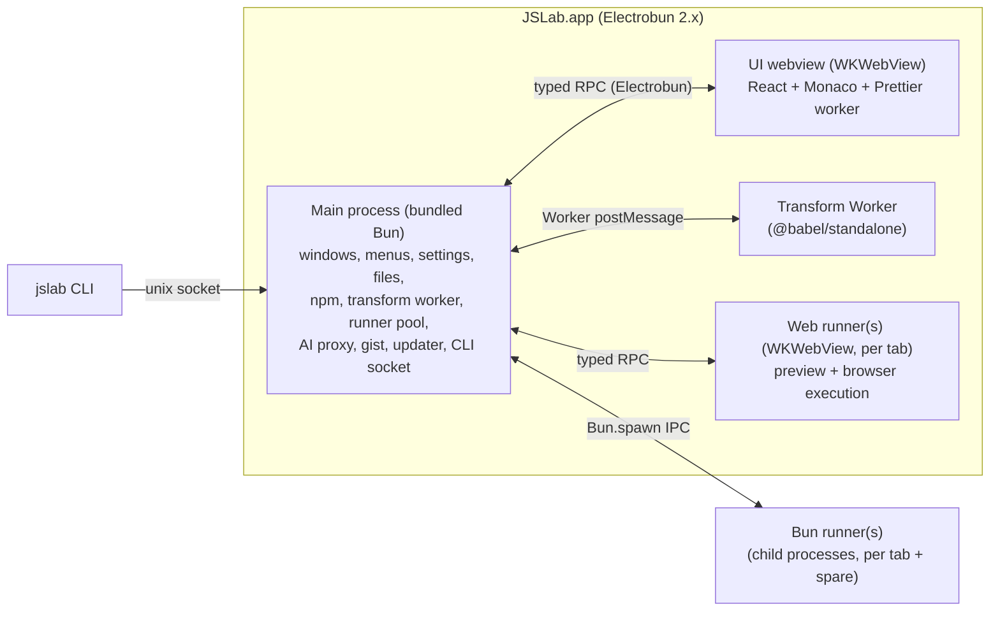
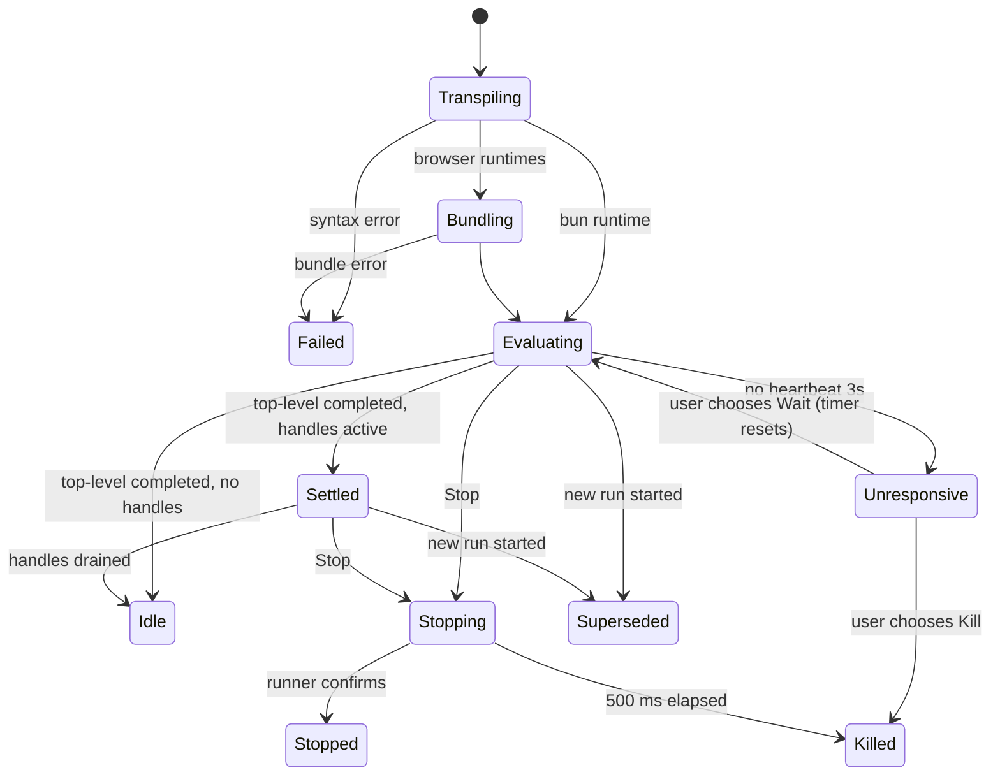

# JSLab: Design Specification

| | |
|---|---|
| **Status** | Draft for review |
| **Date** | 2026-09-12 |
| **License** | MIT |
| **Target** | v1.0, macOS arm64 first; Windows and Linux follow post-v1 |
| **Reference product** | RunJS 4.1.0 (feature parity target) |
| **Companion docs** | [`docs/parity.md`](../../parity.md) (feature-parity checklist and v1 acceptance gate) |

---

## 0. Clean-room policy

JSLab is an independent, open-source implementation. **No RunJS code, binaries, or bundled assets are read or reverse engineered.** Requirements in this spec come only from:

1. RunJS's public website and documentation (runjs.app, including archived public doc pages).
2. The public GitHub repository `lukehaas/RunJS`: README, CHANGELOG, release notes, issues, discussions, and the published UI translation strings.
3. The observable behavior of the app as a user sees it, plus the user's own settings files.

Where a behavior or default value isn't publicly documented, **JSLab defines its own.** Contributors must not add knowledge taken from RunJS binaries (`app.asar`, packaged JS, `.deb`/`.AppImage` contents).

---

## 1. Overview

JSLab is a desktop scratchpad for JavaScript and TypeScript. You write code, and it runs as you type, with each result shown next to the line that produced it. Features:

- Four languages: JS, TS, JSX, TSX.
- Three runtimes per tab:
  - **Bun**: Node-compatible.
  - **Browser**: DOM.
  - **Browser & Node APIs**: DOM plus a Node API bridge.
- An npm package manager.
- TypeScript-powered autocomplete, diagnostics, and hover.
- Magic comments and logpoints.
- A live web view for DOM, canvas, and React output.
- Snippets and AI chat.

JSLab is free and MIT licensed. Every feature RunJS keeps behind a paid license is available to everyone.

### 1.1 Goals

- **G1: Parity.** Every user-facing RunJS 4.1.0 capability in `docs/parity.md` is present, or its intentional difference is documented.
- **G2: Correct JavaScript semantics.** Instrumentation must never change hoisting, strict mode, module semantics, or console ordering. RunJS's most frequent bug class breaks this.
- **G3: Never lose the app to user code.** Infinite loops, crashes, and hangs in user code can't freeze the UI or cause a crash loop at launch.
- **G4: Selected features RunJS declined or lacks:**
  - custom themes and a VS Code theme importer
  - custom keybindings
  - a `jslab` CLI
  - GitHub Gist publish/open
  - editable build options
  - format on save
  - loop protection that also covers `for…of`, `for…in` and `for await…of` loops
- **G5: Small and fast.** It uses the system WebKit, with no bundled Chromium. See the performance budgets in §23.

### 1.2 Non-goals (v1)

- Windows and Linux builds. The code stays cross-platform, but they aren't shipped or QA'd.
- Intel Macs. Electrobun doesn't publish an x64 build.
- Multi-file projects, a file tree, debugger or breakpoints, run selection, watching files for external changes, and a web playground. All of these are on the post-v1 roadmap (§27).
- Node.js or Deno as a runtime. The adapter interface exists, but only Bun ships.
- A URL scheme or deep links. RunJS's deep link was a remote-code-execution hole (RunJS #500).
- Telemetry or crash-reporting services.

### 1.3 Owner prerequisites (before the first signed release)

| Item | Decision / action |
|---|---|
| Bundle identifier | `dev.jslab.app`. The owner must control `jslab.dev`, or change the identifier before the first signed build, because it can't change once updates ship. |
| Apple Developer ID + notarization credentials | Needed for M6 CI (§19) |
| GitHub organization/repo | Hosts the source, releases (update feed), and the Gist OAuth App client ID |
| GitHub OAuth App | Device-flow enabled, for Gist sign-in (§15). Only the public client ID ships. |

---

## 2. Decision summary

| # | Decision | Choice | Rationale |
|---|---|---|---|
| D1 | Desktop shell | Electrobun 2.x, `build.mainProcess: "bun"`, exact version pins | User requirement. The real Bun runtime is used instead of the default Cottontail. |
| D2 | User-code runtime | Bun only, behind a `RuntimeAdapter` interface | Bun is Node-compatible, already bundled, runs TS natively, and installs fast. The adapter leaves room for Node/Deno later. |
| D3 | Browser-mode engine | System WKWebView (no CEF) | Adds nothing to app size. The trade-offs are Safari-class web APIs and some Electrobun CEF bugs avoided. |
| D4 | Editor | Monaco | TS language service built in, proven in WKWebView (Co(lab)). |
| D5 | Execution architecture | A warm child Bun process per tab with a fresh process per run; light Babel AST instrumentation; a per-tab WKWebView for browser modes | Isolation, killability, real ESM semantics, one pipeline. |
| D6 | Transform | `@babel/standalone` in a Bun Worker: TS + React presets, optional proposals, JSLab instrument plugin | One pass handles parsing, type stripping, and instrumentation, and supports the proposal toggles. |
| D7 | Package manager | Bundled Bun (`bun add` / `bun remove` / `bun outdated`) against a shared app-data project | No npm needed; fast; reads `.npmrc`. |
| D8 | UI stack | React 19 + Vite + TypeScript + Zustand; i18next | The Electrobun template exists, and the ecosystem is mature. |
| D9 | Platforms | macOS arm64 at v1; Windows/Linux later | Electrobun is most mature on macOS. |
| D10 | License | MIT | Adoption-friendly, and matches the ecosystem. |
| D11 | Secrets | macOS Keychain via a `security` CLI adapter | Better than RunJS's plaintext storage. |
| D12 | Extras in v1 | Custom themes + keybindings, CLI, Gist | Most-requested features RunJS lacks. |

---

## 3. Glossary

| Term | Meaning |
|---|---|
| **Main** | The Electrobun main process (bundled Bun). Owns every privileged operation. |
| **UI** | The React/Monaco application running in the main window's WKWebView. |
| **Runner** | The process or webview that executes user code for one tab: a *Bun runner* (child process) or a *Web runner* (WKWebView). |
| **Spare** | A pre-started, idle Bun runner, ready to take the next run. |
| **Run** | One execution of a tab's code. It has a `runId` and produces `RunEvent`s. |
| **Runtime** | Per-tab execution environment: `bun`, `browser`, or `browser-node`. |
| **Auto Log** | Automatic display of each top-level expression's value. |
| **Magic comment** | `//?` or `/*?*/` markers that log an expression's value. |
| **Logpoint** | A gutter marker that acts as a virtual magic comment on its line. |
| **Handle** | A reference to a value still alive in a runner, expanded lazily on demand. |
| **Working directory (WD)** | A per-tab folder used for cwd, relative imports, `fs`, and `.env`. |

---

## 4. System architecture

### 4.1 Processes



| Process | Responsibility | Must NOT |
|---|---|---|
| Main | All disk/network/OS access, runner orchestration, state authority for settings and session | Execute user code in-process |
| UI | Rendering, editing, formatting (Prettier worker), Monaco language workers | Access the filesystem or network directly; hold secrets |
| Transform Worker | Babel parse, transform, and instrumentation; source maps | Hold state between runs, beyond caches |
| Bun runner | Execute one run's module; hook console; serialize values; answer expansion requests | Talk to anything but Main |
| Web runner | Execute browser bundles; render the preview; hook console; Node bridge client | Access Main APIs beyond the runner RPC schema |

### 4.2 Run data flow

1. The UI debounces edits (`run.autoRunDelayMs`, default 300 ms), or the user presses Run. The UI sends `run.start { tabId, code, language, runtime, logpoints }`.
2. Main cancels the tab's in-flight run (§5.8) and asks the Transform Worker for `{ code, map, diagnostics }`.
3. The next step depends on the runtime:
   - **`bun`:** Main writes `entry.<ext>` (§5.3), takes the tab's spare, and sends `run`.
   - **`browser` / `browser-node`:** Main calls `Bun.build` (§5.12), then tells the tab's Web runner to reload and load the bundle.
4. The runner emits `RunEvent`s. Main maps generated positions to source lines using the source map, batches the events (flushing every 16 ms or every 200 events), and sends `run.events` to the UI. These batch parameters are verified (M0-S7, packaged canary): at 200 events every 16 ms (~11.8k events/s) Electrobun RPC delivered every event with 0 gaps, p95 latency 5 ms and a worst frame of 26 ms. A 1000-event headroom run (~59k events/s) was equally clean, so there is no reason to change the defaults. S7 verified transport only: each synthetic event was a sequence number plus a 180-character string, and the spike measured receipt timing, not the rendering of real run events (encoded values, the output tree). M1 must not treat 16 ms / 200 events as a render budget.
5. The runner enforces the per-run output cap (§5.10), so a flood never crosses IPC. Main tracks run state (§5.7).

### 4.3 RPC contracts

All contracts live in `packages/rpc-schema`: TypeScript types plus zod validators. Main validates every inbound payload, and an invalid one is rejected and logged. There are three channels:

- **UI ⇄ Main** (`JSLabUIRPC`): Electrobun `BrowserView.defineRPC` / `Electroview.defineRPC`.
- **Web runner ⇄ Main** (`JSLabWebRunnerRPC`): a separate, narrower schema.
- **Bun runner ⇄ Main** (`RunnerIPC`): Bun's `Bun.spawn({ ipc, serialization: "json" })` using JSON messages. The serializer is set explicitly because Bun's default `"advanced"` serializer is not compatible across Bun versions (M0-S3: a Bun 1.3.13 child crashed deserializing a message from the Bun 1.4.0 main process, and worked with `"json"`).

Rules:

- **Requests** are used for request/response operations with a bounded duration. The default `maxRequestTime` is 10 s; npm, AI, and dialog operations use `Infinity`.
- **Messages** are used for streams (run events, npm progress, AI chunks, menu commands).
- **Native dialogs are never awaited inside a request handler.** Electrobun #156 can deadlock there. File dialogs use a message-plus-result-message pattern: `file.openDialog` goes to Main, and Main replies with `file.openDialogResult`.
- **Streaming payloads are batched.** Electrobun encrypts each RPC message.

The full schema sketch is in Appendix A.

### 4.4 Repository layout (Bun workspaces monorepo)

```
apps/
  desktop/                 Electrobun app: electrobun.config.ts, hutch.config.ts
    src/main/
      index.ts             bootstrap: windows, menus, RPC wiring
      windows/             main window, settings window, window-state persistence
      menu/                application menu model -> Electrobun ApplicationMenu
      session/             session + buffers persistence (atomic writes)
      settings/            load/migrate/validate/save settings
      runs/                RunCoordinator, runner pool, event batching, source mapping
      runtimes/            RuntimeAdapter interface + bun adapter + web adapter
      transform/           Transform Worker host
      npm/                 package manager service + registry search + types feeder
      ai/                  provider adapters + streaming proxy
      gist/                GitHub device flow + gist API
      cli/                 unix socket server + e2e automation (JSLAB_E2E=1)
      secrets/             Keychain adapter
      platform/            workarounds for Electrobun gaps (one file per gap, upstream issue linked)
      updater/             Electrobun Updater wiring
      logging/             rotating log files, debug-log export, redaction
  ui/                      React + Vite webview app
    src/
      app/                 shell layout, routing between panels
      editor/              Monaco setup, language config, type libs, logpoint gutter, vim
      output/              virtualized output list, value tree renderer, table renderer
      tabs/  sidebar/  statusbar/  activitybar/
      panels/              npm, env vars, snippets, ai chat, gist dialogs
      settings/            settings window app (separate entry)
      keybindings/         command registry + keybinding resolver
      themes/              theme application (Monaco + CSS variables)
      i18n/                i18next setup + locale JSON
      rpc/                 typed client
  cli/                     `jslab` launcher (Bun-compiled single file, shipped in bundle)
packages/
  rpc-schema/              contracts + zod validators (shared)
  transform/               Babel pipeline + instrument plugin + loop protection (pure)
  serializer/              value encoding (runner side) + decoding model (UI side)
  runner-bun/              preload bootstrap for Bun runners
  runner-web/              bootstrap page + node polyfills + node bridge client for Web runners
  npm/                     pure helpers: spec parsing, registry search client, types discovery
  themes/                  built-in themes + VS Code theme converter
  shared/                  settings schema (zod) + defaults + migrations, snippet/session schemas, command IDs
docs/
  superpowers/specs/       this spec
  superpowers/plans/       implementation plans
  parity.md                parity checklist
  user/                    user documentation (incl. bun-vs-node.md)
```

### 4.5 App data layout

The root is Electrobun's `Utils.paths.userData`, which is laid out as `~/Library/Application Support/dev.jslab.app/<channel>/` (for example `…/stable/`). Dev and canary builds therefore never share data with stable.

```
settings.json          versioned settings (+ settings.json.bak)
session.json           tabs, order, layout, window state (+ .bak)
keybindings.json       user keybinding overrides
env.json               environment variables (file mode 0600)
snippets.json          snippet library
buffers/<tabId>.<ext>  auto-saved tab contents (closed tabs: buffers/closed/)
themes/                user-imported themes (*.jslab-theme.json)
packages/              shared npm project: package.json, bun.lock, .npmrc, node_modules/
npm-home/              empty HOME for npm operations; never holds an .npmrc (§11.3)
runs/<tabId>/          generated entry files + source maps for the current run
cache/                 transform + browser vendor bundle caches; system-fonts.json (systemFonts adapter)
ai/conversation.json   current AI conversation
jslab.sock             CLI socket (0600)
run.lock               present while a run is active; used for crash-loop detection
safe-mode.next         written by Help → Restart in Safe Mode; consumed at the next launch
e2e-screenshots/       JSLAB_E2E=1 launches only: window screenshots
e2e-*.json, e2e-*.txt  JSLAB_E2E=1 launches only: scripted dialog answers, clipboard, opened paths and external links
logs/                  main.log (rotating, 5 × 5 MB)
```

The Keychain service name is `dev.jslab.app`, with accounts `ai.<provider>` and `github`.

### 4.6 Platform adapters (Electrobun gap workarounds)

Each adapter lives in `apps/desktop/src/main/platform/`, exposes a small interface, and links its upstream issue. When upstream fixes land, the adapter is replaced.

| Adapter | Gap | v1 implementation |
|---|---|---|
| `saveDialog` | No save dialog (Electrobun #233) | `osascript -e 'POSIX path of (choose file name default name "…" default location …)'`, spawned from Main and answered over an RPC message, so the UI stays responsive. Adopted **provisionally** (M0-S6). Verified: escaping, a real "Choose File Name" window, and a responsive UI while it is open. Still pending a manual check: the chosen path, Cancel → `null` through AppleScript's `-128`, names containing quotes, whether the dialog comes to the front, and whether a dialog left untouched for at least 60 s stays open. In M0 an untouched dialog resolved to the default path on its own after a variable delay (6.8 s and 27.6 s in two app runs); the cause is unexplained. If that happens for users, Save As silently returns the default path, so M2 must not trust an unconfirmed result. NSSavePanel through FFI is a later option. |
| `fileAssociations` | Can't register existing UTIs (#551) | One idempotent patch script (`plutil -remove`, then `-insert`) writes `CFBundleDocumentTypes` with `LSHandlerRank: Alternate` into `Info.plist`. It is wired to **both** the Hutch `postBuild` and `postWrap` hooks. On macOS `postWrap` alone patches only the self-extracting installer stub, because the real app has already been compressed into the install payload by then. M0-S5 proved the patching mechanism, LaunchServices registration for all 8 extensions, and `open-url` delivery. It did **not** prove signing: the as-packaged canary failed `codesign --verify --deep --strict` (exit 1). The cause was not isolated because no unpatched build was checked, so it is unknown whether the patch broke Hutch's signature or the signature was already invalid. An ad-hoc re-sign after patching (`codesign --force --deep -s -`) verifies. The app must be signed after the patch; M6 verifies this. Electrobun 2.0.1's native `app.fileAssociations` config field is untried: evaluate it in M6 before committing to the hook patch. |
| `systemFonts` | No `queryLocalFonts` in WKWebView | `system_profiler SPFontsDataType -json`, cached, run in the background |
| `accelerators` | Menu accelerators are single-key with Cmd/Ctrl | Menu shows items; multi-modifier shortcuts are handled by the UI keybinding registry, and the menu label shows the shortcut text |
| `secrets` | No keychain API | `security add-generic-password` / `find-generic-password` via `Bun.spawn` |
| `loginShellEnv` | GUI apps lack the shell `PATH` | Run `$SHELL -ilc 'env -0'` once at startup (2 s timeout) and merge the result over the app's environment (`JSLAB_*` always comes from the app). `JSLAB_E2E=1` launches skip it. |
| `webviewWatchdog` | WKWebView can freeze after sleep (#550) | Heartbeat RPC every 2 s; after 3 missed beats, reload the UI view and rehydrate from Main |

---

## 5. Execution engine

### 5.1 RuntimeAdapter interface

```ts
interface RuntimeAdapter {
  id: 'bun' | 'browser' | 'browser-node';
  prepare(tab: TabRunContext): Promise<void>;          // warm spare / web runner
  start(run: PreparedRun, sink: RunEventSink): Promise<RunHandle>;
  invalidate(tab: TabRunContext): void;                // env/WD/settings changed → recycle spares
  dispose(tabId: string): Promise<void>;
}
interface RunHandle {
  runId: string;
  stop(): Promise<void>;       // graceful; escalates to kill after 500 ms
  kill(): void;                // immediate
  expand(handleId: string): Promise<EncodedValue>;
}
```

### 5.2 Runtimes

| Runtime id | UI label | Globals | Node APIs | Web view tile | Types fed to Monaco |
|---|---|---|---|---|---|
| `browser-node` (**default**) | Browser & Node APIs | DOM + web APIs | Pure modules polyfilled; `fs`, `child_process`, `os` through an async bridge (§5.13) | Available | `dom` lib + `@types/node` |
| `bun` | Bun (Node-compatible) | Bun/Node globals, no DOM | Full (Bun) | Hidden | `bun-types` + `@types/node`, no `dom` |
| `browser` | Browser | DOM + web APIs | None | Available | `dom` lib only |

The default is set by `run.defaultRuntime`. Tabs change runtime from the status bar or the Actions → Runtime menu, and a change triggers a run when Auto Run is on.

### 5.3 Bun runner: module semantics

- **Runner binary:** `process.execPath`, the Bun that Electrobun bundles (1.4.0 in Electrobun 2.0.1), with no separately pinned Bun (M0-S3). In the packaged app it spawns with IPC, resolves packages through `NODE_PATH`, supports top-level `await` and is killable with `SIGKILL`, and it is ready in about 10 ms. Runners are copied files, found at `join(PATHS.RESOURCES_FOLDER, "app", <dir>)`. The IPC channel still sets `serialization: "json"` (§4.3), so a separately pinned runner Bun stays possible later (R9).
- The entry file is `<appdata>/runs/<tabId>/entry-<runId>.mjs`. It is always `.mjs`: Babel output is plain ESM JavaScript, and a `.ts` extension would make Bun transpile it again. No `sourceMappingURL` comment is written, so Bun reports generated positions and Main does all source mapping.
  - It sits outside the packages project on purpose, so walk-up resolution finds nothing and `NODE_PATH` alone controls package lookup (below).
  - The file is written atomically, and its source map is written beside it.
- Code runs as a real **ES module** through `await import(pathToFileURL(entry))` in the runner; every run writes a new `entry-<runId>.mjs`, so no cache-busting query is needed. Supported natively:
  - top-level `await`
  - static and dynamic `import`
  - `import.meta`
  - `require` (Bun allows `require` in ESM)
  - `node:` specifiers
- **Bare specifier resolution order** is implemented with `NODE_PATH`, set at spawn to `<WD>/node_modules:<appdata>/packages/node_modules` (without the WD entry when no WD is set). Bun's built-ins always resolve first. Verified on Bun 1.3.13 on 2026-09-12: `NODE_PATH` and walk-up resolution both work for a spawned runner, but a preload `Bun.plugin` `onResolve` hook does **not** intercept bare imports of dynamically imported modules, so no runtime plugin is used. M0-S3 re-verified `NODE_PATH` resolution on the bundled Bun 1.4.0; walk-up resolution and the `onResolve` result were not re-checked there.
- **Relative specifiers** (`./x`, `../x`) resolve against the WD when a WD is set, and against the entry directory otherwise. Local `.ts` and `.tsx` files in the WD run natively through Bun; they are not instrumented.
- **WD globals.** When a WD is set, `process.cwd()` is the WD. `__dirname`, `import.meta.dir`, `import.meta.dirname` and `module.path` report the WD, and `__filename`, `import.meta.path`, `import.meta.filename` and `module.filename` report `<WD>/<tab title>.<ext>` (a saved file's own name when it has one); `import.meta.url` is that file's `file://` URL. The transform replaces those free identifiers and rewrites string-literal relative specifiers (static and dynamic imports, `export … from`, `require`, `require.resolve`) to absolute paths under the WD; a computed specifier resolves against the entry folder. `cwd` is passed at spawn. A WD that no longer exists fails the run before transform with `WorkingDirectoryError` (§12.2).
- **Environment** is built at spawn, in this order (later entries override earlier ones):
  1. The login-shell environment (§4.6).
  2. `env.json` variables.
  3. The WD's `.env` (parsed by JSLab).
  4. `JSLAB=1`.

  Bun's own `.env` auto-loading is disabled with `--no-env-file`. The flag is required: in M0-S3 the same child without it loaded the `cwd`'s `.env`.
- **Spares** are per tab, and a spare is keyed by `(cwd, envHash, runnerSettingsHash)`. Changing the WD, environment variables, or runner-affecting settings recycles the spare.

### 5.4 Transform pipeline

The pipeline lives in `packages/transform`. The Transform Worker runs:

1. **Parse.** Uses `@babel/parser` with plugins chosen by language: `typescript` (with `dts: false`), `jsx`, plus the enabled proposals (§8, Build). `sourceType: "module"`, `allowAwaitOutsideFunction: true`.
2. **Instrument** (the JSLab plugin, §5.5) on the original AST, before any other transform, so line numbers are the user's original lines.
3. **Transform.**
   - `@babel/preset-typescript` with `onlyRemoveTypeImports: false`. Babel 8 always supports `declare` fields (fixes RunJS #526) and rejects the old `allowDeclareFields` option.
   - `@babel/preset-react` with `runtime: "automatic"` for JSX and TSX. `importSource` is `react`, resolved from packages.
   - Enabled proposal plugins (§8 Build): `proposal-decorators` (`version: "2023-11"` or `"legacy"`), `proposal-pipeline-operator` (`proposal: "hack"`, `topicToken: "%"`), `proposal-do-expressions`, `proposal-throw-expressions`, `proposal-function-sent`, `transform-regexp-modifiers`, `proposal-optional-chaining-assign` (`version: "2023-07"`).
   - No `preset-env`. The target is `esnext`, because Bun and WKWebView support modern syntax.
4. **Generate** code and a source map.
5. **Return** `{ code, map, diagnostics[] }`. Syntax errors are returned as diagnostics with a code frame and position; nothing runs.

Caching is an LRU keyed by `hash(code + language + runtime + settings subset + logpoints)`, with 50 entries.

### 5.5 Instrumentation rules

The runtime helper object is `globalThis.__jl`, installed by the bootstrap and not enumerable. Every call carries the **original** source line as a literal.

**Auto Log** (setting `run.autoLog`) wraps each **top-level `ExpressionStatement`**, meaning one directly in `Program.body`. The following are excluded:

| Excluded | Reason |
|---|---|
| Directive prologue (`"use strict"`, etc.) | Directives must stay directives. Non-directive top-level strings *are* logged (RunJS #733). |
| `AssignmentExpression`, `UpdateExpression` | Avoid echoing reassignments (RunJS #718) |
| `console.*(...)` calls | They already produce output |
| Calls whose value is `undefined` | Hidden at render time unless `run.showUndefined` |

The rewrite is `expr;` → `__jl.log(LINE, (expr));`. A top-level `await` expression logs the awaited value, and promise values are tracked (§5.9).

**Magic comments.** A marker applies to the statement or expression it is attached to:

| Form | Attachment | Logged value |
|---|---|---|
| `stmt //?` (trailing line comment) | The statement ending on that line | `ExpressionStatement` → the expression; `VariableDeclaration` → the value of a single declarator, or `{ a, b }` for several; `ReturnStatement` → the argument; `ThrowStatement` → the argument. For any other statement the editor shows a warning, "Magic comment has no value to log". |
| `expr /*?*/ .rest` (inline block comment) | The innermost expression node ending immediately before the comment | That sub-expression's value, each time it is evaluated |
| `if (c) /*?*/ {`, `while (c) /*?*/ {` | The statement's test | The test value on each evaluation |
| `for (…;c;…) /*?*/ {` | The loop test | The test value on each iteration |
| `for (const x of xs) /*?*/ {` / `for…in` | The loop binding | The bound value(s) on each iteration |
| `//? <expr using $>` | Any of the above | `(( $ ) => <expr>)(value)`, where `$` is the attached value. The original value still flows through. |

Rewrites preserve values: `__jl.mc(LINE, COL, value, formatterFn?)` returns `value`. Markers inside strings and templates are ignored, because detection works on comment AST nodes, not regexes.

**Logpoints** are virtual trailing `//?` markers on the given lines. They reuse the magic-comment attachment on the **innermost statement that starts on that line**. A logpoint on a line with no loggable statement is shown hollow, with a tooltip.

**Loop protection** (setting `run.loopProtection`, default on; limit `run.loopProtectionMaxIterations`, default 2000):
- Every `for`, `for…in`, `for…of`, `for await…of`, `while`, and `do…while` gets a per-entry counter. The counter is `let` scoped just before the loop statement and incremented at the start of the body.
- When the limit is exceeded, it throws `RangeError("Potential infinite loop: exceeded <N> iterations (line <L>). Disable Loop Protection or raise the limit in Settings → Advanced.")`.
- Labeled loops and `continue` keep working, because the increment is the first statement of the body block.

**Never rewritten:**
- Function, class, and variable declarations, other than the `VariableDeclaration` value capture above, which appends a statement after the declaration.
- `import` and `export` declarations, and directives.

**Helper name collisions.** The transform refuses user code that binds `__jl` and returns the diagnostic "`__jl` is reserved by JSLab".

### 5.6 Bun runner bootstrap (`packages/runner-bun`)

The bootstrap is started with `bun --preload <bootstrap> <idle-script>` and connected to Main through `Bun.spawn({ ipc })`. It:

1. Installs `__jl` (`log`, `mc`, and the serializer).
2. **Hooks `console`**: `log`, `info`, `warn`, `error`, `debug`, `table`, `dir`, `dirxml`, `assert`, `count`, `countReset`, `time`, `timeLog`, `timeEnd`, `group`, `groupCollapsed`, `groupEnd`, `trace`, and `clear`. For each call it records the calling position from a lightweight stack capture (generated line/column; Main maps it to the source line).
3. **Hooks `process.stdout.write` / `process.stderr.write`**, which produce `stdout` / `stderr` events.
4. **Tracks active handles** by wrapping `setTimeout`, `setInterval`, `setImmediate`, `Bun.serve`, `net.createServer`, `http.createServer`, `child_process.spawn`/`exec`, `WebSocket`, and `fetch` (through an AbortController registry). `process.getActiveResourcesInfo()` is **not** used: on Bun 1.3.13 it returns `[]` even while a timer is pending (checked 2026-09-12; not re-checked on the bundled Bun 1.4.0).
5. Listens for `uncaughtException` and `unhandledRejection`, which become `error` events.
6. Sends a heartbeat every 500 ms from the JS thread.
7. On `run`, applies `cwd` and settings, then `await import(entry)`, then emits the state `settled`, then `idle` once no tracked handles remain.
8. On `stop`, clears tracked timers, closes servers, aborts fetches, kills child processes, flushes events, and emits `stopped`.
9. On `expand`, resolves a handle from its registry. The registry is a `Map<id, WeakRef|value>` scoped to the run.

A finished runner **stays alive** (holding its values) to answer `expand` requests until the next run, tab close, or 5 minutes idle. After that, handles render as `…` with the tooltip "Value no longer available. Re-run to inspect."

### 5.7 Run state machine



Status bar and activity bar indicators:

| State | Indicator |
|---|---|
| Evaluating | Spinner |
| Settled | Pulsing dot, labeled "N active handles", with a Stop button |
| Idle / Stopped | Nothing |
| Failed | Red dot |

Superseding a run kills its runner immediately; spares make this cheap. Late events from a superseded `runId` are dropped.

### 5.8 Stop, Kill, Unresponsive

- **Stop** (`Cmd+Shift+R`, activity bar): graceful stop as in §5.6, step 8. If the runner hasn't confirmed within 500 ms, Main kills it. Output is preserved.
- **Kill** (Actions → Kill, `Cmd+Alt+R`): sends `SIGKILL` to a Bun runner, or destroys and recreates a Web runner. Output is preserved, and an entry "Run killed" is appended.
- **Unresponsive:** after 3 s (`run.unresponsiveTimeoutMs`) with no heartbeat while Evaluating, the UI shows the dialog "This tab isn't responding: [Kill] [Wait]". Choosing Wait resets the timer.

### 5.9 Value serialization (`packages/serializer`)

The encoding is JSON-safe and tagged. The full type is in Appendix B. Rules:

| Rule | Limit (JSLab default) |
|---|---|
| Eager depth | 3 levels; deeper values become `handle` |
| Properties per object eagerly | 100; the rest are available through a handle (`more: n`) |
| Collection entries (Array/Map/Set/typed arrays) | 1,000 eagerly; the rest through a handle |
| String preview | 10,000 chars; full text through a handle, up to 1 MB |
| Per-event encoded size | 256 KB; beyond that, the root becomes a handle with a preview |

**Text bounds (M2, R-M2-T19B-1/2):** a single stdout/stderr write larger than about 256 KB is shown truncated, ending with `…` and the number of bytes not shown. Error messages are clipped at 16 KB and error names at 1 KB, each ending with `…`.

Special cases:
- **Getters:** own accessors on plain objects and class prototypes are shown as `(...)` and evaluated on expand. The exception is the native side-effect-free getter allowlist (`Map.size`, `ArrayBuffer.byteLength`, `URL.*`, `Response.status`, …), which is evaluated eagerly.
- **Promises:**
  - Encoded as `{t:'promise', state}`.
  - If a promise is pending when logged, the runner attaches a `then` handler and emits `promiseSettled { ref: seq, value }`, and the UI updates that entry in place, e.g. `Promise { <fulfilled>: 42 }` or `Promise { <rejected>: Error… }`.
- **Circular references** are encoded as `{t:'circ', ref}`.
- **Other types:**
  - Class instances show their constructor name.
  - Functions show `kind` and name. Source is available on expand, truncated to 2 KB.
  - Errors include `name`, `message`, `stack` (mapped), and `cause`.
  - Also covered: Date, RegExp, Symbol, BigInt, NaN, -0, Infinity, Buffer, URL, Headers, Response, Request, and DOM nodes (Web runner: tag, attributes, child count, outerHTML preview).
- **Proxies** are shown as their target, with a `Proxy` badge, and are never unwrapped through traps.

### 5.10 Output events and limits

`RunEvent` kinds are `result`, `console`, `stdout`, `stderr`, `error`, `promiseSettled`, `state`, and `truncated` (Appendix B).

- There is a cap of 10,000 entries per run (`output.maxEntries`). When the cap is hit, output switches to a single `truncated { dropped }` marker that keeps counting.
- The runner batches events every 16 ms, and Main re-batches them to the UI.
- `console.clear()` clears the panel for the current run.
- `console.table` renders as a table (columns = union of keys, max 1,000 rows), and `console.group*` renders indentation.

### 5.11 Errors

| Phase | Presentation |
|---|---|
| Transpile | Red squiggle and hover message in the editor; output shows one error entry with a code frame. The previous run's output stays, dimmed, labeled "Last successful run". |
| Bundle (browser) | Same presentation. Unresolved imports offer "Install <pkg>" (§11.4). |
| Runtime (thrown / unhandled rejection) | An error entry with name, message, and a source-mapped stack. Frames in user code are clickable (`L12:5`) and move the caret; internal frames are collapsed. The editor adds an inline error decoration on the throwing line. |
| Runner crash (exit ≠ 0 without `done`) | "Runtime exited unexpectedly (code N / signal S)" plus the stderr tail. The next spare is used on the next run. |
| User `process.exit` | Not an error. Pending output is flushed, and the runner exits once IPC drains, at most 2 s later. Code after the call doesn't run. |
| A caught `process.exit` (for example inside `try/catch`) | Still ends the run: later output is dropped and handles created afterwards are disposed. If user code keeps the runner from exiting, Main ends it 2.5 s after the request and reports the requested exit code. |

### 5.12 Web runners (`browser`, `browser-node`)

- **Web runner creation.** Each browser-mode tab gets one Web runner: an `<electrobun-webview>` embedded in the output area's Web View tile.
  - It uses its own partition, `persist:runner-<tabId>`.
  - It loads `views://runner-web/index.html`, which contains a bare `<div id="root"></div>` page with no stylesheet.
  - When the tile is hidden, the webview stays alive but collapsed to zero size. Verified in M0-S4: collapsed to 0×0 for 10 s, `setInterval` kept 100% and `requestAnimationFrame` 104% of the uncollapsed rate. No throttling was measured, so no 1×1-offscreen fallback is needed.
- **Bundling.** Uses `Bun.build({ entrypoints:[entry], target:'browser', format:'esm', sourcemap:'external', plugins:[jslabResolve, nodePolyfills(runtime), cssInject] })`.
  - npm packages come from `packages/node_modules`.
  - CSS imports (from packages or the WD) are injected as `<style>`.
  - Third-party code is cached as a vendor chunk keyed by `bun.lock` hash plus the import set.
- **Execution:**
  1. For each run, Main sends `runner.reset`.
  2. The page reloads, which gives a fresh realm and DOM.
  3. The bootstrap installs `__jl` and the console hooks, and requests the bundle over RPC.
  4. It runs the bundle with `import(URL.createObjectURL(new Blob([code], {type:'text/javascript'})))`.
- **Heartbeats and handles:** the same heartbeat, handle tracking (timers, `requestAnimationFrame` loops, AudioContexts, WebSockets), and Stop semantics as §5.6. On Stop, rAF loops are cancelled and AudioContexts closed.
- **Dialogs:** inside an embedded `<electrobun-webview>`, `alert` / `confirm` / `prompt` are **not** blocking in Electrobun 2.0.1. M0-S4 found they return `undefined` / `false` / `null` in about 1 ms with no user interaction, so no blocking native panel is shown. JSLab therefore uses the async fallback: it shows its own non-blocking dialog, `alert` returns immediately after showing it, `confirm` returns `false` and `prompt` returns `null`, and a console warning explains the limitation. Still open (a UX detail that doesn't change this design): whether a native panel briefly flashes, which the shim may need to suppress.
- **`fetch`:**
  - In `browser` it is the native `fetch`, with CORS enforced (true browser behavior).
  - In `browser-node` it is routed through Main (Node-like, no CORS). The response is streamed back, with `Response` semantics preserved.
- **Audio indicator:** while any AudioContext is running or a media element is playing, the tab shows a speaker icon; clicking it toggles mute.

### 5.13 `browser-node` Node API layer

| Module | Implementation |
|---|---|
| `buffer`, `path`, `events`, `util`, `url`, `querystring`, `string_decoder`, `assert`, `stream`, `punycode` | Browser polyfills, bundled (sync, full) |
| `process` | Polyfill; `env`, `cwd()`, `platform`, `argv`, `versions` come from a snapshot at page load; `nextTick` uses the microtask queue |
| `crypto` | `randomUUID`, `getRandomValues`, `webcrypto`; `createHash`/`createHmac` via a bundled polyfill |
| `fs/promises`, callback-style `fs.*` | Async bridge over RPC to Main, scoped to the tab's permissions (full user permissions, same as `bun`) |
| `fs.*Sync` | Throw `JSLabUnsupportedError: fs.readFileSync isn't available in "Browser & Node APIs". Use fs/promises or switch this tab to the Bun runtime.` |
| `child_process.exec/execFile/spawn` | Async bridge; streams stdout/stderr events; `*Sync` throws as above |
| `os` | Snapshot values (sync) |
| `http`, `net`, `tls`, `dgram`, `worker_threads`, `vm` | Throw `JSLabUnsupportedError` with the switch-to-Bun hint |

### 5.14 Safe launch and crash-loop protection

- **Restored tabs never auto-run at launch.** Auto Run starts on a tab's first edit or on an explicit Run. The status bar shows "Paused: press ⌘R to run".
- **Crash-loop detection.** Main writes `run.lock` while any run is Evaluating and removes it when the run ends. If `run.lock` still exists at startup, the previous session likely hung or crashed, and JSLab starts in **Safe Mode**:
  - Auto Run is disabled for the session.
  - A banner reads "JSLab didn't shut down cleanly while running code. Auto Run is paused for this session."
- **Manual Safe Mode:** hold Shift during launch, or choose Help → Restart in Safe Mode.
- **Edit → Clear Editor** empties the current tab. It is undoable.

---

## 6. Editor

### 6.1 Monaco configuration

- `monaco-editor` is bundled locally. Its workers (editor, ts) are emitted by Vite and loaded from `views://mainview/…`. Verified in M0-S2 with plain (non-inline) `?worker` imports, so no Blob-URL fallback is needed. The import specifiers are `monaco-editor/editor/editor.worker?worker` and `monaco-editor/languages/features/typescript/ts.worker?worker`. They omit `esm/vs/` because the package's `exports` map (`"./*": "./esm/vs/*.js"`) already adds it.
- **One model per tab.** URIs are `file:///tab/<tabId>.<ext>`. Models persist view state (cursor, selections, scroll, folding) in the session.
- **Language by tab:** `typescript` for TS/TSX, `javascript` for JS/JSX. JSX is enabled through compiler options.
- **TS compiler options per tab runtime:**
  ```ts
  { target: ESNext, module: ESNext, moduleResolution: Bundler, jsx: ReactJSX, strict: true,
    allowJs: true, checkJs: false, allowNonTsExtensions: true, esModuleInterop: true,
    allowSyntheticDefaultImports: true, experimentalDecorators: <build.decorators==='legacy'>,
    moduleDetection: Force, skipLibCheck: true,
    lib: runtime==='bun' ? ['esnext'] : ['esnext','dom','dom.iterable'] }
  ```
  - Top-level await is valid (`moduleDetection: Force`).
  - Diagnostics never block execution.
- **Diagnostics on/off** is controlled by `editor.linting`, through `setDiagnosticsOptions`.
- **Per-tab application.** Monaco's TypeScript defaults are global, so JSLab re-applies the compiler options, diagnostics options and extra libraries whenever the shown tab, its runtime, `build.decorators` or `editor.linting` changes, and only when a value actually changes (each change restarts the TypeScript worker).
- **`lib` file names.** `compilerOptions.lib` lists full lib file names (`lib.esnext.d.ts`, plus `lib.dom.d.ts` and `lib.dom.iterable.d.ts` for the browser runtimes). Monaco's worker reads each entry as a file name; tsconfig short names leave the DOM lib unloaded.
- **Removed diagnostic codes:** 1375 and 1378 (top-level await) are always suppressed. 2307 ("Cannot find module") is shown with the install code action (§6.3).

### 6.2 Type feeder

- **Built-in libraries:** `@types/node` 22.20.2 (with `undici-types` 6.21.0) and `bun-types` 1.4.2 ship in the app as two lazily loaded UI chunks and are added as extra libs for the runtimes that need them (§5.2).
- **Installed packages** are handled by the `npm/types` service in Main:
  1. It reads `package.json` `types`/`typings`/`exports[types]`.
  2. It falls back to `@types/<name>`.
  3. It collects the `.d.ts` closure, following relative references, up to 5 MB per package.
- **Type-declaration versioning:** The bundled type packages' `typesVersions` maps are matched against Monaco's bundled TypeScript (5.9.3); non-matching version directories are excluded.
- **Loading.** The UI requests types for the import specifiers found in the model (debounced 500 ms) and registers them with `addExtraLib(content, 'file:///node_modules/<pkg>/…')`. A registered package is never requested twice, and types are invalidated when packages change.
- **WD-local modules:** `.ts`, `.d.ts`, and `.js` files imported relatively from the WD are fed the same way at `file:///tab/<path relative to the WD>`, limited to 200 files. A relative import that leaves the WD gets no editor types.

### 6.3 Code actions and editor affordances

- **"Install package `x`"** is offered on unresolved bare imports (TS 2307), and also when the runtime reports a module-not-found error.
- **"Install `@types/x`"** is offered when a package has no types.
- **Logpoint gutter.** Clicking the glyph margin toggles a logpoint, shown as a filled dot, or hollow when the line has no loggable statement.
  - `F9` toggles the current line, and `Cmd+Shift+F9` clears all.
  - Logpoints are tracked as Monaco decorations with `stickiness`, so they follow their lines through edits (fixes RunJS #731).
  - Any logpoint change triggers Auto Run.
- **Output hover link.** Hovering an output entry highlights its source line with a line decoration.
- **Inline error decoration** marks the throwing line (§5.11).
- **Vim:** `monaco-vim` when `editor.vimKeys` is on; the mode shows in the status bar. `Cmd+R` runs in every Vim mode (fixes RunJS #652). The Vim clipboard register `"+` maps to the system clipboard. Writes to `"+` go through the same clipboard path as Output → Copy All (M2, R-M2-PF3).
- **Pastes over 5 MB** show a confirmation: "Pasting 12.4 MB may make JSLab slow. Continue?"
- **Hover delay** is set by `editor.hoverDelayMs`, default 400.
- `F1` shows hover info at the cursor, and `Cmd+F1` shows the diagnostic at the cursor. Monaco's F1 command palette is disabled in v1.

### 6.4 Formatting

- **Prettier 3** runs in a UI Web Worker using the `babel`, `typescript`, and `estree` plugins.
- Triggers:
  - Actions → Format Code (`Alt+Shift+F`).
  - Before each run when `run.formatOnRun` is on. Formatting is skipped while the editor has focus and typing happened in the last 1 s, so the cursor doesn't jump.
  - On save when `editor.formatOnSave` is on.
- **Edits** are applied as a minimal Monaco edit (`executeEdits` over a line diff, bracketed by `pushUndoStop`), so undo, folding, scroll, and cursor are preserved. This fixes RunJS #639 and #654.
- **Timeout:** a format request fails after 10 s plus 5 s per MB of code, at most 60 s. The worker restarts, the status bar says "Couldn't format", and the run or save goes ahead. A request pending for more than 300 ms shows "Formatting…" in the status bar.
- **Options:** all `prettier.*` settings (§8).
- **Failure** (a syntax error) leaves the code unchanged and shows a status-bar message.

### 6.5 Keybindings

- **Command registry.** Every action is a `CommandId`, e.g. `run.start` or `tab.reopenClosed`, with a handler, a `when` context (`editorFocus`, `outputFocus`, `vimNormal`, …), and a default binding.
- **One resolver in the UI owns keyboard dispatch.** Native menu items dispatch the same `CommandId` through the `menu.command` message.
- **User overrides** are stored in `keybindings.json` as `[{ "key": "cmd+shift+enter", "command": "run.start", "when": "editorFocus" }, { "key": "cmd+k", "command": "-output.clear" }]`. The format is VS Code-style; a leading `-` removes a binding.
- **Command palette** (⌘⇧P): a context-sensitive list of every enabled command except the ones hidden from the palette, grouped by category, with match highlighting, inline state descriptions and keycaps. It was pulled into v1 by the M2 UI decision ("Graphite with a spice of Daylight Rail").
- **Settings → Keybindings:**
  - A searchable table: Command, Keybinding, When, Source (Default/User).
  - A key-capture editor that warns on conflicts.
  - "Reset to default" per row.
  - "Open keybindings.json".

**Default keybindings (macOS).** Win/Linux defaults replace `Cmd` with `Ctrl` unless noted. That column is finalized in the Windows milestone.

| Command | Default | Notes |
|---|---|---|
| Open… | `Cmd+O` | |
| Save / Save As… | `Cmd+S` / `Cmd+Shift+S` | |
| New Tab / Close Tab | `Cmd+T` / `Cmd+W` | |
| Reopen Closed Tab | `Cmd+Shift+T` | |
| Close Other Tabs | `Cmd+Alt+T` | |
| Next / Previous Tab | `Cmd+Alt+Right` / `Cmd+Alt+Left`; also `Ctrl+Tab` / `Ctrl+Shift+Tab` | |
| Go to Tab 1–9 | `Cmd+1` … `Cmd+9` | |
| Settings… | `Cmd+,` | |
| Run / Stop / Kill | `Cmd+R` / `Cmd+Shift+R` / `Cmd+Alt+R` | Run works in every Vim mode |
| Format Code | `Alt+Shift+F` | |
| Clear Output | `Cmd+K` | Monaco `Cmd+K` chords are disabled |
| NPM Packages… | `Cmd+I` | |
| Snippets… | `Cmd+B` | |
| AI Chat | `Ctrl+Cmd+I` | |
| Toggle Line / Block / Magic Comment | `Cmd+/` / `Cmd+Alt+/` / `Cmd+Alt+Shift+/` | |
| Toggle Logpoint / Clear All Logpoints | `F9` / `Cmd+Shift+F9` | |
| Trigger Suggestions | `Ctrl+Space` | |
| Show Hover / Show Diagnostic | `F1` / `Cmd+F1` | |
| Find / Replace | `Cmd+F` / `Cmd+Alt+F` | |
| Find Next / Previous | `Cmd+G` / `Cmd+Shift+G` | |
| Go to Line… | `Ctrl+G` | |
| Delete Line | `Ctrl+Shift+K` | |
| Select Line | `Cmd+L` | |
| Split Selection into Lines | `Cmd+Shift+L` | |
| Insert Line Before / After | `Cmd+Shift+Enter` / `Cmd+Enter` | |
| Select Next Occurrence | `Cmd+D` | |
| Expand Selection (scope) | `Cmd+Shift+Space` | |
| Select to Bracket / Go to Bracket | `Cmd+Shift+M` / `Cmd+M` | Cmd+M overrides macOS Minimize in the editor; Window → Minimize keeps working from the menu |
| Move Line Up / Down | `Cmd+Ctrl+Up` / `Cmd+Ctrl+Down` | |
| Join Lines | `Cmd+J` | |
| Duplicate Line | `Cmd+Shift+D` | |
| Sort Lines / Sort Lines (case-insensitive) / Reverse (case-insensitive) | `F5` / `Cmd+F5` / `Cmd+Shift+F5` | Win/Linux: `Alt+F5` variants (avoids the F9 conflict) |
| Delete to Line Start | `Cmd+Backspace` | |
| Add Cursor Above / Below | `Ctrl+Shift+Up` / `Ctrl+Shift+Down` | |
| Zoom In / Out / Reset | `Cmd+=` / `Cmd+-` / `Cmd+0` | Scales editor, output, sidebar |
| Toggle Full Screen | `Ctrl+Cmd+F` | |

---

## 7. User interface

### 7.1 Main window layout

```
┌───────────────────────────────────────────────────────────────────────────┐
│ ● ● ●   [tab: fetch users ●] [tab: scratch] [+]                            │  ← title bar (hiddenInset) + tab bar (drag region)
├──┬──────────────┬───────────────────────────────┬──────────────────────────┤
│▶ │ Side bar      │ Editor (Monaco)               │ Output tiles             │
│■ │ (AI Chat |    │                               │ ┌ Console ────────────┐  │
│{}│  Snippets)    │                               │ │ 42              L3 │  │
│📦│               │                               │ │ ▸ {id:1,…}      L7 │  │
│✨│               │                               │ └────────────────────┘  │
│⚙ │               │                               │ ┌ Web View ───────────┐  │
│  │               │                               │ └────────────────────┘  │
├──┴──────────────┴───────────────────────────────┴──────────────────────────┤
│ Browser & Node APIs ▾ │ TypeScript ▾ │ 🖥 Web View │ ⇆ Split │ 📁 ~/proj │ ● Running │ NORMAL │
└───────────────────────────────────────────────────────────────────────────┘
```

- **Activity bar** (toggle `view.activityBar`): Run, Stop, Snippets, NPM Packages, AI Chat; Settings at the bottom. It shows the run-state badge.
- **Side bar** (toggle `view.sideBar`): hosts the AI Chat or Snippets panel. Resizable, 240–600 px.
- **Tab bar:** hidden when there's one tab and `view.tabBarForSingleTab` is off.
- **Toolbar row:** the title-bar row (38 px, the window drag region) holds the traffic lights, the tabs, and on the right the Auto Run toggle and the Run/Stop button.
- **Editor/output split:**
  - Horizontal (side by side, default) or vertical (stacked).
  - The divider is draggable; the default is 55/45, stored per tab. Double-clicking the divider resets the split to 50/50.
  - Status bar "Split" toggles the orientation, and View → Output toggles the output area.
- **Output area tiles:** Console and Web View. Tiles are arranged by dragging their headers (stacked or side by side, stored per tab). The Web View tile is unavailable in the `bun` runtime.
- **Status bar** (toggle `view.statusBar`, 28 px):
  - Left: run state (dot and label), Safe Mode badge, status message.
  - Right: runtime selector, language selector, Web View toggle (M4), Split orientation toggle, WD chip (M3; click → change/clear; tooltip shows the full path), Vim mode, cursor position.

### 7.2 Output panel

- **List:** virtualized (`@tanstack/react-virtual`). While scrolled to the bottom it auto-scrolls to the newest entry; scrolling up pins the position.
- **Entry anatomy:** a 3 px level stripe (result, log, info, warn or error; only error rows are tinted), the value renderer, and a right-edge `:n` line anchor whose accessible name is `L<n>`. Clicking the anchor moves the caret to that line and focuses the editor; hovering the entry highlights the editor line.
- **Value tree:**
  - Expandable nodes, with "Expand all" in the entry menu.
  - Nested objects and `[[Prototype]]` start collapsed.
  - Handles load on expand, with a spinner.
  - Strings print raw at the top level and quoted when nested.
  - `Cmd`-click on URLs opens the default browser.
- **Entry `⋯` menu:** Explain Result (AI), Copy (formatted: JSON when serializable, otherwise inspect-style), Copy as JSON, Expand All.
- **Panel context menu:** Copy (when text is selected), Copy All, Clear.
- **Syntax highlighting of values** uses theme tokens and is controlled by `output.highlighting`, default on.
- **Line-number badges:** `output.showLineNumbers`, default on.
- **Filter chips** above the list: All, Results, Logs, Errors.
- **Copy All is filtered (M2, R-M2-T19A-1):** Copy All copies the entries visible under the current filter chip, not the whole output. This intentionally changes the M1 behavior, which copied every entry.

### 7.3 Tabs

- New (`+`, `Cmd+T`) uses the default language and runtime.
- Close options: `Cmd+W`, the × button, middle-click, and the context menu.
- The tab context menu offers: Rename…, Close, Close Others, Close to the Right, Reveal in Finder (saved files), Copy Path.
- **Reopen closed** is a stack of the last 20 closed tabs, holding content, language, runtime, WD, and file path.
- **Title:**
  - A user-set title wins.
  - A saved file uses its filename.
  - Otherwise the title is the first non-empty line of code, trimmed to 30 characters, or "Untitled".
- **Dirty dot:** shown for saved-file tabs with unsaved changes. Unsaved scratch tabs show no dot, because they're auto-persisted.
- **Confirm Close** (`tabs.confirmClose`) asks before closing any tab. Separately, a saved file with changes always prompts "Save changes to x.ts?" with Save, Don't Save, and Cancel.
- Tabs reorder by dragging, and a saved-file tab's tooltip shows the full path.
- **Closing the last tab** opens a fresh empty tab. `Cmd+W` on a single empty tab closes the window; the app stays in the Dock, and clicking the Dock icon reopens it.
- **Dropped files** open in new tabs, one per file. The webview doesn't get a dropped file's path, so each opens as an unsaved scratch copy titled with the file's name and with no file path: ⌘S asks Save As, and Reveal in Finder and Copy Path are disabled. A Main-side native drop that keeps the path is planned for M3. Non-text files and files over 50 MB are rejected, and files over 5 MB open only after confirmation. A dropped folder shows a notice pointing at Actions → Set Working Directory… (§12.2).

### 7.4 Application menu

Menu items dispatch `CommandId`s. Items without a native accelerator show their shortcut text.

- **JSLab:** About JSLab · Check for Updates… · Settings… · Install `jslab` Command… · Services · Hide JSLab · Hide Others · Show All · Quit JSLab
- **File:** New Tab · Open… · Open Gist… · Save · Save As… · Publish to Gist… · Reopen Closed Tab · Close Tab · Close Window
- **Edit:** Undo · Redo · Cut · Copy · Paste · Delete · Select All · Find · Replace · Go to Line… · Toggle Line Comment · Toggle Block Comment · Toggle Magic Comment · Toggle Logpoint · Clear All Logpoints · Create Snippet… · Clear Output · Clear Editor
- **Actions:** Run · Stop · Kill · Format Code · Set Working Directory… · Clear Working Directory · Runtime ▸ (Browser & Node APIs · Bun · Browser) · Language ▸ (TypeScript · JavaScript · TSX · JSX) · Show Transpiled Output
- **Tools:** NPM Packages… · Environment Variables… · Snippets… · AI Chat
- **View:** Actual Size · Zoom In · Zoom Out · Output · Web View · Side Bar · Activity Bar · Status Bar · Tab Bar · Layout ▸ (Horizontal · Vertical) · Enter Full Screen
- **Themes:** (all installed themes, with a checkmark on the active one) · Follow System Appearance · Import VS Code Theme… · Open Themes Folder
- **Window:** Minimize · Zoom · Bring All to Front
- **Help:** Documentation · Bun vs Node Differences · What's New · Report Issue · Copy Debug Log · Open Logs Folder · Restart in Safe Mode

Each milestone adds the items whose features it ships; M2 ships File (New Tab, Open, Save, Save As, Reopen, Close Tab, Close Window), Edit, Actions (Run/Stop/Kill, Format, Runtime, Language), View, Themes, Window and Help (Copy Debug Log, Open Logs Folder, Restart in Safe Mode).

The Edit menu uses Electrobun roles (`undo`, `redo`, `cut`, `copy`, `paste`, `selectAll`) so clipboard shortcuts work in WKWebView. The Edit menu has no `delete` role: Electrobun 2.0.1 gives that role the unmodified Delete key as its key equivalent, which takes Backspace away from Monaco. The JSLab menu has no Services item, because Electrobun 2.0.1's menu roles (`menuRoles.ts`) include no services role.

**Show Transpiled Output** opens a read-only side tab with the latest Babel output for the current tab. It updates on each run, and a toggle hides the instrumentation calls.

### 7.5 Dialogs and panels

| Panel | Location | Content |
|---|---|---|
| NPM Packages | Modal sheet | §11 |
| Environment Variables | Modal sheet | §12 |
| Snippets | Side bar panel (or modal when the side bar is hidden) | §13 |
| AI Chat | Side bar panel | §14 |
| Open Gist / Publish to Gist | Modal | §15 |
| Settings | Separate window, 760×560, remembers its position | §8 |
| About | Native-style modal: version, Bun version, Electrobun version, license, credits (open-source notices) |
| What's New | Opens after an update with that release's notes (bundled Markdown) |
| First run | A welcome tab with sample code showing Auto Log, `//?`, logpoints, fetch, and a React snippet |

The Settings window buffers messages that arrive before its view subscribes (the latest 32 per message name), so an early message is never lost (M2, R-M2-T24-4).

---

## 8. Settings

Settings are stored in `settings.json` with `{ "version": N, ... }` and validated by the zod schema in `packages/shared`. Unknown keys are preserved, invalid values are replaced with defaults (and logged), and migrations run by version. Changes apply live unless noted.

The Settings window has these tabs: **General · Editor · Formatting · Appearance · Keybindings · AI · NPM · Build · Advanced**.

| Tab | Key | Type | Default | Description |
|---|---|---|---|---|
| General | `run.autoRun` | bool | `true` | Run code automatically as you type |
| General | `run.autoLog` | bool | `true` | Show the value of each top-level expression |
| General | `run.defaultRuntime` | enum | `browser-node` | Runtime for new tabs |
| General | `run.defaultLanguage` | enum | `typescript` | Language for new tabs |
| General | `run.formatOnRun` | bool | `false` | Auto-format code on each run |
| General | `tabs.confirmClose` | bool | `false` | Ask before closing a tab |
| General | `app.uiLanguage` | enum | `system` | `system`, `en`, `es`, `ja`, `zh`, `pt`. Restart required. |
| Editor | `editor.lineNumbers` | bool | `true` | |
| Editor | `editor.lineWrap` | bool | `true` | |
| Editor | `editor.vimKeys` | bool | `false` | |
| Editor | `editor.closeBrackets` | bool | `true` | |
| Editor | `editor.invisibles` | bool | `false` | Render whitespace |
| Editor | `editor.activeLine` | bool | `false` | Highlight the cursor line |
| Editor | `editor.autocomplete` | bool | `true` | |
| Editor | `editor.linting` | bool | `true` | TypeScript diagnostics inline |
| Editor | `editor.hoverInfo` | bool | `true` | |
| Editor | `editor.hoverDelayMs` | int 100–2000 | `400` | |
| Editor | `editor.signatures` | bool | `true` | Parameter hints |
| Editor | `editor.formatOnSave` | bool | `false` | |
| Editor | `editor.minimap` | bool | `false` | |
| Formatting | `prettier.printWidth` | int | `80` | |
| Formatting | `prettier.tabWidth` | int | `2` | |
| Formatting | `prettier.useTabs` | bool | `false` | |
| Formatting | `prettier.semi` | bool | `true` | |
| Formatting | `prettier.singleQuote` | bool | `false` | |
| Formatting | `prettier.quoteProps` | enum | `as-needed` | `as-needed`, `consistent`, `preserve` |
| Formatting | `prettier.jsxSingleQuote` | bool | `false` | |
| Formatting | `prettier.trailingComma` | enum | `all` | `all`, `es5`, `none` |
| Formatting | `prettier.bracketSpacing` | bool | `true` | |
| Formatting | `prettier.bracketSameLine` | bool | `false` | |
| Formatting | `prettier.arrowParens` | enum | `always` | `always`, `avoid` |
| Appearance | `appearance.theme` | string | `graphite` | Theme id |
| Appearance | `appearance.followSystem` | bool | `false` | Use the light/dark theme pair below |
| Appearance | `appearance.lightTheme` / `darkTheme` | string | `graphite-light` / `graphite` | |
| Appearance | `appearance.font` | string | `JetBrains Mono` | Bundled or system font |
| Appearance | `appearance.fontSize` | int 8–72 | `14` | Editor and output |
| Appearance | `appearance.fontLigatures` | bool | `true` | |
| Appearance | `appearance.uiScale` | number | `1.0` | Changed by zoom commands |
| Appearance | `view.tabBarForSingleTab` | bool | `true` | |
| Appearance | `view.activityBar` | bool | `true` | |
| Appearance | `view.statusBar` | bool | `true` | |
| Appearance | `view.sideBar` | bool | `false` | |
| Appearance | `view.layout` | enum | `horizontal` | Default split for new tabs |
| Appearance | `output.highlighting` | bool | `true` | |
| Appearance | `output.showLineNumbers` | bool | `true` | |
| AI | `ai.provider` | enum \| null | `null` | `openai`, `anthropic`, `gemini`, `mistral`, `ollama`, `custom` |
| AI | `ai.model.<provider>` | string | from manifest | |
| AI | `ai.baseUrl.<provider>` | string | `""` | Blank = the provider's standard endpoint |
| AI | `ai.includeOutput` | bool | `true` | Send recent output as context |
| AI | *(API key)* | Keychain | none | Show/hide field, Remove button |
| NPM | *(.npmrc editor)* | file | `registry=https://registry.npmjs.org/` | Reset and Save buttons |
| NPM | `npm.allowInstallScripts` | bool | `false` | |
| NPM | `npm.autoInstallTypes` | bool | `false` | Install `@types/x` automatically when missing |
| Build | `build.decorators` | enum | `2023-11` | `none`, `2023-11`, `legacy` (TS experimentalDecorators) |
| Build | `build.pipelineOperator` | bool | `false` | Hack-style `\|>` with `%` topic |
| Build | `build.doExpressions` | bool | `false` | |
| Build | `build.throwExpressions` | bool | `false` | |
| Build | `build.functionSent` | bool | `false` | |
| Build | `build.regexpModifiers` | bool | `true` | |
| Build | `build.optionalChainingAssign` | bool | `true` | |
| Advanced | `run.showUndefined` | bool | `false` | |
| Advanced | `run.loopProtection` | bool | `true` | |
| Advanced | `run.loopProtectionMaxIterations` | int 100–10,000,000 | `2000` | |
| Advanced | `run.autoRunDelayMs` | int 0–5000 | `300` | |
| Advanced | `run.unresponsiveTimeoutMs` | int 1000–60000 | `3000` | |
| Advanced | `output.maxEntries` | int 100–100,000 | `10000` | |
| Advanced | `updates.auto` | bool | `true` | Download and install updates automatically |
| Advanced | `updates.channel` | enum | `stable` | `stable`, `canary` |
| Advanced | *(buttons)* | — | — | Open Data Folder · Reset All Settings… · Restart in Safe Mode |
| Advanced → Accounts | *(GitHub sign-in)* | Keychain | none | Sign in with GitHub · Use token… · Sign out |
| Advanced | `gist.defaultVisibility` | enum | `secret` | |

---

## 9. Themes and fonts

### 9.1 Theme format

`*.jslab-theme.json`:
```json
{
  "id": "dracula", "name": "Dracula", "type": "dark", "version": 1,
  "monaco": { "base": "vs-dark", "inherit": true, "rules": [ { "token": "keyword", "foreground": "FF79C6" } ],
              "colors": { "editor.background": "#282A36" } },
  "ui": { "bg": "#21222C", "bgElevated": "#282A36", "fg": "#F8F8F2", "fgMuted": "#6272A4", "border": "#191A21",
          "accent": "#BD93F9", "danger": "#FF5555", "warning": "#F1FA8C", "success": "#50FA7B",
          "selection": "#44475A", "outputString": "#F1FA8C", "outputNumber": "#BD93F9", "outputKey": "#8BE9FD" }
}
```

UI colors are applied as CSS variables. From M2 on, built-in themes are semantic token sets from `@jslab/themes` rather than the `ui` object sketched above: `bg.canvas`, `bg.chrome`, `bg.elevated`, `bg.hover`, `bg.selection`, `bg.activeRow`, `bg.errorRow`, `bg.errorRowHover`, `bg.lineHover`, `bg.lineHighlight`, `bg.accentMuted`, `bg.scrim`; `border.default`, `border.muted`, `border.accent`; `fg.default`, `fg.muted`, `fg.accent`, `fg.onAccent`, `fg.success`, `fg.warn`, `fg.error`, `fg.info`; `console.result`, `console.log`, `console.info`, `console.warn`, `console.error`; and `syntax.comment`, `syntax.keyword`, `syntax.string`, `syntax.number`, `syntax.type`, `syntax.function`. Each token is a CSS variable (`bg.canvas` → `--bg-canvas`), the Monaco theme is built from the same tokens, and every text token meets WCAG AA on each surface it is drawn on. The output value renderer uses the `console.*` and `syntax.*` tokens. The M5 VS Code importer and `*.jslab-theme.json` files map onto this token set.

### 9.2 Built-in themes

All built-in themes are free. Each is built from a publicly licensed palette, and license notices are listed in About → Credits.

- **Default pair:** Graphite (dark, default) and Graphite Light: JSLab's own semantic token palettes. Every text/background pair meets WCAG AA.
- **Dark:** Graphite (default), Dracula, One Dark, Monokai, Material Darker, Ayu Dark, Ayu Mirage, SynthWave '84, Shades of Purple, Nord, Night Owl, Catppuccin Mocha, GitHub Dark, Solarized Dark, Tomorrow Night
- **Light:** Graphite Light (default light theme), GitHub Light, Solarized Light, Catppuccin Latte, Ayu Light, Visual Studio Light (a VS-style palette)

### 9.3 VS Code theme importer

Themes → Import VS Code Theme… accepts:
- A theme `.json` file (with `tokenColors` and `colors`).
- A `.vsix` file: JSLab extracts `extension/package.json` `contributes.themes` and lets the user pick a theme.

Conversion:
- `tokenColors` TextMate scopes are mapped to Monaco token rules using a scope-to-token table.
- `colors` are passed to Monaco `colors`, and UI variables are derived from `editor.background`, `sideBar.background`, `activityBar.background`, `statusBar.background`, `focusBorder`, `errorForeground`, and so on, with contrast fallbacks.
- The result is saved to `<appdata>/themes/` and shows up in the Themes menu immediately.

Invalid files produce a readable error.

### 9.4 Fonts

- **Bundled** (OFL/Apache licensed): JetBrains Mono (default), Fira Code, DejaVu Sans Mono, Hack, Ubuntu Mono, Source Code Pro.
- **System fonts** come from the `systemFonts` adapter, monospace first, then all. They're listed after a separator in the font picker. A failed installed-font scan isn't retried for 10 minutes, and the Font picker says "Couldn't load installed fonts" (M2, R-M2-T24-6).
- If a font fails to load, JSLab falls back to the default and shows a notice.

---

## 10. Tabs, files, persistence

### 10.1 Session

`session.json` (schema in Appendix C):
- **Window:** frame and display id. Restored if the display still exists, otherwise centered on the primary display. A restored frame is clamped to at least 400×300.
- **Tabs:** tab order, active tab id, reopen-closed stack (content stored in `buffers/closed/`).
- **Per tab:**
  - `id`, `title`, `titleIsCustom`, `language`, `runtime`, `filePath`, `workingDirectory`, `gistId`
  - `layout` (split orientation and size, tiles arrangement, output/web-view visibility)
  - `viewState` (Monaco cursor/scroll/folding)
  - `lastSavedHash`
- Logpoints are **not** persisted, which matches RunJS's documented behavior.

**Writes:**
- Session changes are debounced to 500 ms.
- Buffer writes are debounced to 500 ms per tab.
- Everything is written atomically (`write tmp → fsync → rename`), and the previous file is kept as `.bak`.
- On quit, pending writes are flushed.

The session JSON is built when a write starts, not on every change (M3 FA-m9). Settings writes are bounded at 10 s each: a hung write fails, is logged, and never overwrites a newer file. Before the quit flush, the UI flushes pending view-state saves and buffer edits (at most 500 ms), and while typing it sends each tab's buffer at most every 150 ms.

### 10.2 Files

- **Open** (`Cmd+O`) uses `Utils.openFileDialog`, filtered to `js, jsx, ts, tsx, mjs, cjs, mts, cts, json, txt`, with multi-select. Each file opens in a new tab, unless it's already open, in which case that tab is focused.
  - **Language** follows the extension: `.ts/.mts/.cts` → TS, `.tsx` → TSX, `.jsx` → JSX, anything else → JS.
- **Save** writes to `filePath`, or runs Save As when the tab has none. Format on save applies first if enabled.
- **Save As** uses the `saveDialog` adapter. The default name is the title plus the language extension, in the last-used folder.
- **Encoding and line endings:** UTF-8, keeping the line endings detected on open.
- **Files over 5 MB** show a confirmation before opening, and files over 50 MB are refused. A tab's text is capped at 64 MB: above that, JSLab stops auto-saving and running the tab and says so in the status bar, so an edit is never dropped silently.
- **File associations:** see §4.6. Opening a file from Finder (the `open-url` event with `file://`) opens it in a new tab.

### 10.3 Window behavior

- The app runs a single main window in v1.
- Closing the window keeps the app running (macOS convention), and clicking the Dock icon reopens it.
- Quitting flushes state (the session, buffers and `settings.json`), disposes runners, and removes `run.lock`.

---

## 11. NPM package manager

### 11.1 Project

`<appdata>/packages/` holds:
- `package.json`: `{ "name": "jslab-packages", "private": true, "dependencies": {}, "trustedDependencies": [] }`
- `bun.lock`
- `.npmrc`
- `node_modules/`

Built-in type packages ship inside the app, not in this project.

### 11.2 Panel UI (`Cmd+I`, Tools, activity bar)

- **Search field** with the placeholder "Search npm, or type name@version". Registry search starts 300 ms after typing stops.
  - Results list name, version, description, weekly downloads when available, and an **Add** button.
  - Input like `name@1.2.3`, `name@^1`, `@scope/name@latest`, a git URL, or a tarball URL installs that exact spec.
- **Installed table** columns: Name · Installed · Latest (with an **Update** button when outdated) · Remove.
  - It has a sticky header, and a newly added row is highlighted for 2 s.
  - Toolbar: **Update all**, and a **Show `@types`** toggle.
- **"Allow install scripts" checkbox** (`npm.allowInstallScripts`).
- **Log drawer** that streams install output.

### 11.3 Operations

Each operation runs the bundled Bun (`process.execPath`) with `cwd = <appdata>/packages`. The environment is the login-shell environment with two overrides, so the user's `~/.npmrc` is ignored.

- **`HOME=<appdata>/npm-home`:** an app-owned directory that never contains an `.npmrc`. Bun reads the user-level config from `$HOME/.npmrc`. Verified in the packaged app with the bundled Bun 1.4.0 (M0-S8 Run 3):
  - Setup: an empty project `.npmrc`, and a user-home `.npmrc` whose only line is a dead scoped registry.
  - The scoped install fails when `HOME` is that home, and succeeds with `HOME=<empty npm-home>`.

  The following do **not** isolate:
  - `NPM_CONFIG_USERCONFIG`: Bun ignores it (M0-S8, in-app).
  - `XDG_CONFIG_HOME` and `BUN_CONFIG_NO_GLOBAL_NPMRC=1`: `$HOME/.npmrc` is still read (M0-S8 out-of-app controls with the same bundled Bun).
  - `BUN_CONFIG_REGISTRY`, or a `registry=` line in the project `.npmrc`: these override only the default registry, and scoped `@scope:registry` keys from `~/.npmrc` still apply (M0-S8 out-of-app controls).
- **`BUN_INSTALL_CACHE_DIR`:** set to the user's Bun cache, which is the login-shell `BUN_INSTALL_CACHE_DIR` if set. The package cache stays shared and never lands in `npm-home`. `<real HOME>/.bun/install/cache` is not a safe fixed fallback, because a login-shell `BUN_INSTALL` or `XDG_CACHE_HOME` may move the user's cache (verified for the bundled Bun 1.4.0 in M3 Task 9: `bun pm cache` precedence is `BUN_INSTALL_CACHE_DIR` > `$BUN_INSTALL/install/cache` > `$XDG_CACHE_HOME/.bun/install/cache` > `<real HOME>/.bun/install/cache`). M3 must resolve the path itself and always set `BUN_INSTALL_CACHE_DIR` explicitly, never relying on a default derived from the environment or from the overridden `HOME`. M0-S8 verified that Bun honors this variable while `HOME` is overridden.

With `HOME` overridden, `~/.npmrc` no longer applies, and `<packages>/.npmrc` is the intended source of registry, scoped registry and auth settings; its `registry=` line takes effect (M0-S8). It is not guaranteed to be the only source: the spawn environment is the login-shell environment, and M0-S8 C3 showed Bun honours `BUN_CONFIG_REGISTRY`. M3's npm service must therefore strip inherited `BUN_CONFIG_*`, `NPM_CONFIG_*` and `npm_config_*` variables from the install environment. A login-shell `XDG_CONFIG_HOME` could point Bun at a global `bunfig.toml`, so the npm environment strips it too, and sets `NO_COLOR=1` so output parses reliably. `BUN_INSTALL_CACHE_DIR` is resolved in this order, verified against `bun pm cache` on the bundled Bun (M3 Task 9): the login-shell `BUN_INSTALL_CACHE_DIR`, `$BUN_INSTALL/install/cache`, `$XDG_CACHE_HOME/.bun/install/cache`, `<real home>/.bun/install/cache`.

Because `HOME` is overridden, git-URL specs and install scripts also see `npm-home`, with no `~/.gitconfig` or `~/.ssh`. `SSH_AUTH_SOCK` and `GIT_SSH_COMMAND` pass through unchanged, so git over SSH authenticates through the user's agent or an explicit command; `HOME` is never restored (a documented limitation, M3 QA Q8).

| Operation | Command |
|---|---|
| Install | `bun add --exact <spec>`. With install scripts allowed, the package is also added to `trustedDependencies` before install. |
| Remove | `bun remove <name>` |
| Outdated | `bun outdated` (parsed); refreshed when the panel opens, at most every 10 min; a failed check is cached for the same period; capped at 30 s and preempted (aborted, without recording an error) if the user installs, removes or updates a package while it runs |
| Update | `bun add --exact <name>@latest` |
| Search | HTTP GET `<registry>/-/v1/search?text=<q>&size=25`, with the registry and auth taken from `.npmrc` |
| Update all | `bun add --exact` with every dependency `@latest` |

- **Limits:** operations are serialized through a queue, with a timeout of 5 min each.
- **Errors** are classified (network, 404/ETARGET, peer conflict, script blocked, native build failure, disk) and shown with a one-line fix hint and the raw log.
- **After any change:**
  - the type feeder cache is invalidated
  - Web runner vendor caches are invalidated
  - Bun runner spares are recycled
  - the UI refreshes

### 11.4 Install assist

- **Unresolved imports.** An unresolved bare import (editor diagnostic, or a runtime/bundle module-not-found error) offers "Install `<pkg>`". The package name is derived from the specifier: a scoped `@a/b/c` becomes `@a/b`, and `node:` and built-ins are ignored.
- **Missing types.** When an installed package has no types and `@types/<pkg>` exists in the registry, the editor offers "Install types". With `npm.autoInstallTypes` on, the types are installed automatically.

### 11.5 Settings → NPM

A Monaco editor (ini mode) for `<packages>/.npmrc`, with **Save** and **Reset** (which restores `registry=https://registry.npmjs.org/`). Tokens in `.npmrc` are masked in logs.

---

## 12. Environment variables and working directory

### 12.1 Environment variables (Tools → Environment Variables…)

- **Table:** KEY · VALUE (masked with a reveal toggle) · Remove.
  - The input row is KEY + VALUE + **Add**; rows are edited inline.
  - **Save** persists the table, and **Cancel** discards changes.
- **Validation:** keys match `^[A-Za-z_][A-Za-z0-9_]*$` and must be unique. Values are strings.
- **Storage:** `env.json` (0600), shared by all tabs.
- **Effect:** saving recycles the spares of every tab, so the next run gets the new values.
- **Browser runtimes:** in `browser-node`, values come through the `process.env` snapshot. In `browser`, `process` isn't defined.

### 12.2 Working directory (per tab)

- **Setting it:** Actions → Set Working Directory… (a folder picker) or clicking the WD chip. Electrobun 2.0.1 gives the webview no dropped-folder path, so dropping a folder shows a notice pointing at these (M3 R-M3-SPIKE-1).
- **Clearing it:** Actions → Clear Working Directory.
- **Effects:** as described in §5.3 (cwd, relative imports, `__dirname`, `.env`, resolution order), §6.2 (local types), and §5.12 (CSS imports).
- **Display:** the tab label shows the folder name as a suffix, e.g. "fetch users · api".
- A WD that no longer exists at run time shows the error "Working directory not found: <path>", with a Change… action.

---

## 13. Snippets

### 13.1 Panel (`Cmd+B`)

- **Search box** matches name and description.
- **List:** name + description. The selected snippet shows a preview with syntax highlighting.
- **Actions:** Insert (at the cursor, replacing the selection) · Insert in New Tab · Copy · Edit · Delete (with the confirmation "Delete snippet "<name>"?").
- **New Snippet (+):** Name (the autocomplete trigger; required, unique, `^[\w$-]+$`) · Description · Body (a Monaco editor) · Language hint (optional).
- **Options menu:** Import… (merge; name conflicts get an overwrite, keep both, or skip choice) · Export… (via `saveDialog`, default `jslab-snippets.json`).
- **Editor context menu:** Create Snippet… pre-fills the body with the selection, or with the whole buffer if nothing is selected.

### 13.2 Body syntax

Snippet bodies use Monaco snippet syntax: `$0` marks the final cursor position, and `${1:placeholder}` / `$1` are tab stops. A body without placeholders is inserted literally, with `$` escaped.

### 13.3 Autocomplete

A Monaco `CompletionItemProvider` suggests snippets whose name starts with the typed word (case-insensitive). They appear with a snippet icon and description, and they are suggested even when the full name has been typed (RunJS #488).

### 13.4 File format

```json
{ "format": "jslab-snippets", "version": 1,
  "snippets": [ { "id": "uuid", "name": "fetchjson", "description": "Fetch + parse JSON",
                  "body": "const res = await fetch(${1:url});\nconst data = await res.json();\n$0",
                  "language": "typescript", "createdAt": "ISO", "updatedAt": "ISO" } ] }
```

Invalid imports show "This file isn't a valid JSLab snippets file", with details.

---

## 14. AI chat

### 14.1 Panel (`Ctrl+Cmd+I`, activity bar)

- **Header:** provider and model display (clicking it opens Settings → AI), plus **New Chat**.
- **Messages:** rendered Markdown with syntax-highlighted code blocks. Each code block has **Copy**, **Insert at Cursor**, and **Replace Editor**.
- **Input:** a textarea with the placeholder "Ask about your code…". Enter sends and Shift+Enter adds a newline. A **Stop** button appears while streaming.
- **No provider configured:** the panel shows a card with "Choose a provider", which opens Settings → AI.

### 14.2 Context

Each request carries a system prompt, bundled with the app (JSLab assistant, with the runtime and language described). It also includes, in order:
1. The current tab's code, up to 100 KB, marked with the language, runtime, and WD name.
2. The most recent run's output when `ai.includeOutput` is on, rendered as text and capped at 20 KB.
3. The conversation history, trimmed from the oldest messages to fit the model's context budget.

**Explain Result**, from an output entry, opens the panel and sends "Explain why line <L> produces this result:" with the rendered value, the code, and the surrounding output.

### 14.3 Providers (Main-side adapters, streaming)

| Provider | API | Models list | Default base URL |
|---|---|---|---|
| OpenAI | Chat Completions / Responses (streaming) | `GET /v1/models` | `https://api.openai.com/v1` |
| Anthropic | Messages API (streaming) | `GET /v1/models` | `https://api.anthropic.com` |
| Gemini | `streamGenerateContent` | `GET /v1beta/models` | `https://generativelanguage.googleapis.com/v1beta` |
| Mistral | Chat Completions (streaming) | `GET /v1/models` | `https://api.mistral.ai/v1` |
| Ollama (local) | `/api/chat` (streaming) | `GET /api/tags` | `http://localhost:11434` |
| Custom | OpenAI-compatible Chat Completions | `GET <base>/models` (optional) | user-supplied (required) |

- **Security:**
  - **Requests go through Main:** the UI sends `ai.send` and receives `ai.chunk` / `ai.done` / `ai.error` messages.
  - **Keys never reach the webview.**
  - **Keys are stored in the Keychain,** under account `ai.<provider>`.
- **Models:**
  - The **Refresh** button fetches the provider's model list.
  - The default model per provider comes from `apps/desktop/src/main/ai/models.json`, which is updated each release.
- **Errors** (401, 429, network, context too long) are shown inline with a retry button.
- **Conversation state:** the current conversation is kept in `ai/conversation.json` and restored at launch; New Chat clears it.

---

## 15. GitHub Gist

- **Accounts (Settings → Advanced → Accounts):**
  - **Sign in with GitHub** uses the OAuth device flow with the public client ID and scope `gist`. The UI shows the user code and a link to `github.com/login/device`, and polls for the token.
  - **Use token…** accepts a personal access token with the `gist` scope.
  - The token is stored in the Keychain (account `github`).
  - **Sign out** deletes the token.
- **Publish to Gist… (File menu, tab context menu):**
  - Fields: description (default: the tab title), visibility (secret/public, default `gist.defaultVisibility`), filename (default: sanitized title plus the language extension).
  - The first publish creates a Gist and stores `gistId` on the tab. Later publishes offer to **Update existing Gist** (the default) or **Create new**.
  - On success, a toast shows the URL with **Copy link** and **Open in browser**.
- **Open Gist… (File menu):**
  - Accepts a Gist URL or ID. Public gists don't need sign-in.
  - With one JS/TS file, it opens in a new tab; with several, a picker lets the user open one or more.
  - Each tab records its `gistId`.
- **Errors** (404, 401, rate limit) are shown with actionable messages.

---

## 16. CLI (`jslab`)

### 16.1 Installation

Help → Install `jslab` Command…:
- A symlink to `JSLab.app/Contents/Resources/app/bin/jslab` (a Bun-compiled single binary) is created in `~/.local/bin`. If `~/.local/bin` isn't on `PATH`, the dialog shows the line to add to the shell profile.
- **Install for all users** instead writes to `/usr/local/bin` via `osascript … with administrator privileges`.
- Uninstall uses the same menu, which becomes "Uninstall `jslab` Command…" when a symlink is detected.

### 16.2 Usage

```
jslab [file ...]                 Open files in new tabs
jslab -                          Read code from stdin into a new tab
jslab --run [file|-]             Open and run immediately
      --runtime bun|browser|browser-node
      --lang ts|js|tsx|jsx       (default: from extension, else settings)
      --cwd <dir>                Set the tab's working directory (default for `-`: current dir)
      --title <title>
jslab --version | --help
```

### 16.3 Protocol

- **Transport:** a unix domain socket at `<appdata>/jslab.sock` (mode 0600), speaking newline-delimited JSON: `{ "v":1, "id":"…", "method":"open", "params":{ "files":[…], "code":"…", "run":false, "runtime":…, "lang":…, "cwd":…, "title":… } }`. The reply is `{ "id":"…", "ok":true, "tabIds":[…] }` or `{ "id":"…", "ok":false, "error":"…" }`.
- **If the app isn't running**, the CLI runs `open -b dev.jslab.app`, polls for the socket for up to 10 s, then sends the request. It never relies on process arguments, which avoids Electrobun #540.
- **Paths are made absolute by the CLI** before sending.
- **Code runs only when `--run` is passed.**
- **E2E automation** (`JSLAB_E2E=1` at app launch only) adds `e2e.*` methods on the same socket (§22.3). They are never available in normal launches. The harness also uses `e2e.quit` and `e2e.reopen`. UI methods, `e2e.state` and `e2e.screenshot` accept `window: "main" | "settings"`.
- **Reply queue (M2, R-M2-T2-1):** the `jslab.sock` server queues replies until the socket drains, so large replies arrive whole instead of being cut off.

---

## 17. Internationalization

- i18next in the UI and a small `t()` in Main (menus, dialogs). Locale files live in `apps/ui/src/i18n/locales/<lng>.json`, and Main reads the same files.
- **v1 locales:** `en` (source), `es`, `ja`, `zh`, `pt`. Changing the language needs a restart (a notice is shown).
- **Enforcement:**
  - There are no hard-coded UI strings; a lint rule flags string literals in JSX.
  - Keys are namespaced (`menu.file.open`, `settings.editor.lineWrap.label`, `settings.editor.lineWrap.help`).
  - A CI check verifies every locale has all keys; missing keys fall back to `en`.
- **Contributors:** `docs/user/translating.md` explains how to add a locale.

---

## 18. Security

| Area | Measure |
|---|---|
| UI webview | CSP: `default-src 'self' views:; script-src 'self' views: 'wasm-unsafe-eval'; worker-src 'self' views: blob:; style-src 'self' views: 'unsafe-inline'; img-src 'self' views: data: blob:; font-src 'self' views: data:; connect-src 'self' views: ws://127.0.0.1:* ws://localhost:*; base-uri 'self'; form-action 'none'`. The `views:` sources serve the bundled assets, remote (`https:`) images are not allowed, and `connect-src` allows Electrobun's local RPC WebSocket (see the risk register). The Settings window page uses the same policy. Navigation rules block every non-`views://` navigation; links open in the default browser through `Utils.openExternal`. |
| RPC boundary | Every inbound payload is zod-validated in Main; path parameters are normalized; there is no generic "exec" or "read any file" endpoint for the UI. The file operations are open dialog, save to a user-chosen path, and read/write of a tab's own file path. |
| Web runners | Separate partition per tab; a narrower RPC schema (`runner.*`, `nodeBridge.*` for `browser-node` only); no access to settings, secrets, or other tabs. |
| User code | Runs with the user's OS permissions, like a terminal. JSLab guarantees process isolation and killability, not a sandbox. The docs say this plainly. |
| Secrets | AI keys and the GitHub token live in the Keychain; `env.json` is 0600; logs redact values of `env.json`, `.npmrc` `_authToken`, `Authorization` headers, and anything matching common key patterns. npm output credentials are masked line by line, per output stream, before reaching the output window, and again in the window; a single line longer than about 64,000 characters can expose a credential split at the cut (an accepted caveat). |
| CLI socket | 0600 permissions under the user's app data; `--run` required to execute code; `e2e.*` only with `JSLAB_E2E=1`. |
| URL schemes / deep links | None registered in v1 |
| Updates | Electrobun updater over HTTPS; artifacts signed and notarized; update JSON hosted with the releases |
| Known upstream risk | Electrobun's local RPC WebSocket upgrade is unauthenticated (#518). This is tracked in the risk register. JSLab contributes or carries a patch before 1.0 if upstream hasn't fixed it. |
| Telemetry | None. There is no analytics or crash-reporting service. |

---

## 19. Updates and distribution

- **Build:** `hutch electrobun build --env=stable|canary` on a GitHub Actions `macos-14` (arm64) runner.
- **Signing:** `build.mac.codesign: true`, `notarize: true`. Credentials come from CI secrets (`ELECTROBUN_DEVELOPER_ID` and the App Store Connect API key variables).
  - The `postBuild` + `postWrap` hook pair (§4.6) patches `Info.plist` for file associations, and the app must be signed after that patch. M0-S5 established only the hook order relative to compression: `postBuild` runs before Hutch compresses the real app into its install payload, and `postWrap` runs after, on the installer stub. It did not establish where signing happens: the as-packaged canary failed `codesign --verify` (cause not isolated; no unpatched build was checked), and only a manual ad-hoc re-sign after patching verified. Signing after the patch, Developer ID signing and notarization with the patched plist are verified in M6.
  - Nested binaries (the `jslab` CLI) are signed with the hardened runtime. M0-S3 saw Hutch leave loose files under `Resources/app` untouched (a copied Bun kept its upstream signature), but only in a canary build without code signing configured. M6 must not assume this holds for signed release builds, and verifies how the `jslab` CLI ends up signed. Runners use the bundled Bun (§5.3), so no extra runner binary is signed. Entitlements: `com.apple.security.cs.allow-jit` and `allow-unsigned-executable-memory` (required by JSC/Bun). M0 did not test the minimal set; M6 verifies it.
- **Artifacts:** `JSLab-<version>-macos-arm64.dmg`, the update `.tar.zst`, bsdiff patches, and `stable-macos-arm64-update.json`.
- **Hosting:**
  - `stable` on GitHub Releases, with `release.baseUrl = https://github.com/<org>/jslab/releases/latest/download`.
  - `canary` in a static bucket (Cloudflare R2 or GitHub Pages).
- **In-app updates:**
  - The updater checks at launch and every 6 hours.
  - When `updates.auto` is on, updates download in the background; the status bar shows "Restart to Update", and the update applies on quit.
  - Check for Updates… runs a manual check.
  - What's New opens after an update.
- **Homebrew:** a `jslab` cask in a tap at first, submitted to `homebrew/cask` after 1.0.
- **Versioning:** SemVer. A `CHANGELOG.md` is generated from Conventional Commits.

---

## 20. Error handling (cross-cutting)

| Layer | Failure | Behavior |
|---|---|---|
| Transform | Syntax error | §5.11; the previous output stays, dimmed |
| Runner | Crash / hang | §5.8, §5.11; the next spare is used |
| Spare startup | Bun fails to start (3 tries) | Status bar "Runtime unavailable" with details; runs are blocked; a Help link opens the logs |
| npm | Any failure | §11.3, classified with a hint |
| AI / Gist | HTTP errors | Inline messages with retry |
| UI webview | Freeze (#550) | §4.6 watchdog reloads it; state is rehydrated from Main |
| Settings / session | Corrupt JSON | Load `.bak`; otherwise defaults plus a notice "Settings were reset because the file was unreadable. A copy was saved as settings.corrupt-<ts>.json" |
| Disk | Write failure (ENOSPC, EACCES) | A toast with the path and error; retried with backoff; no data is lost in memory |
| RPC | Validation failure | Rejected, logged with the method name; a dev build asserts |
| Unexpected Main exception | Uncaught exception or unhandled rejection after startup | Logged; the user sees a dismissible notice banner ("Something went wrong…") with a Copy Debug Log button, and the app keeps running. A failure during startup shows one dialog and exits with code 1 |

**Logging.** `logs/main.log` rotates (5 × 5 MB) with levels `error|warn|info|debug`; debug is enabled with `JSLAB_DEBUG=1`. Help → Copy Debug Log copies `{ version, bunVersion, electrobunVersion, macOS, arch, settings (redacted), last 500 log lines }`. Redacted means: only schema-defined settings fields, every string masked for secrets, the home folder and any `/Users/<name>` prefix written as `~`, and `env.json` values masked everywhere; `.npmrc` content never appears.

---

## 21. Observability for developers

- In dev builds, a `JSLAB_DEBUG=1` overlay in the UI shows the run timeline: transform ms, bundle ms, spawn/spare wait, time to first event, event rate, and RPC batch sizes.
- `hutch electrobun run --inspect` is used for Main debugging, and Web Inspector for webviews in dev builds.

---

## 22. Testing strategy

### 22.1 Unit (`bun test`, per package)

- **`packages/transform`:**
  - **Golden tests:** input fixture → instrumented output (snapshot) for each rule in §5.5.
  - **Semantic tests** run instrumented code in a real Bun subprocess and compare observable behavior with uninstrumented code. Cases:
    - hoisting (function and `var`)
    - TDZ errors
    - `"use strict"` effects
    - `this` at module top level
    - top-level await ordering
    - console-ordering interleaving with results
    - labeled `continue` / `break`
    - generators and async generators
    - loop protection in all six loop kinds, including `for await…of`
    - no double evaluation of expressions with side effects in magic comments or logpoints (for example `i++ //?`)
  - **Source-map tests:** the reported line equals the original line for multi-line expressions, JSX, TS generics, and decorators.
- **`packages/serializer`:**
  - Round-trip and property-based tests (fast-check) over arbitrary nested values, cycles, getters, Proxies, Promise settle updates, and limit truncation.
  - Performance test: encoding 100k-element arrays stays within 50 ms.
- **`packages/shared`:** settings schema defaults, migrations, invalid-value repair.
- **`packages/themes`:** the VS Code converter against 10 real theme fixtures (contrast and required tokens).
- **`packages/npm`:** spec parsing and package-name derivation from specifiers; `bun outdated` output parsing.

### 22.2 Integration (Main-level, `bun test`)

- RunCoordinator with real Bun runners:
  - supersede, Stop escalation, Kill, unresponsive detection, spare recycling on env/WD change
  - `.env` precedence, WD relative imports, and resolution order (WD `node_modules` over app packages)
  - output cap
  - handle expansion after the run finishes, and expiry
- npm service against a local registry (`@jslab/test-registry`, running a pinned Verdaccio per ruling R-M3-REG-1, started under a temp folder with a tracked PID; opt-in with `bun run test:npm`; never run by `bun run test` or CI): install, remove, outdated, search, scripts off/on, `.npmrc` isolation: with the project `.npmrc` pointing at the local registry and a bad *scoped* registry key (for example `@scope:registry=http://127.0.0.1:9/`) in the test `HOME`'s `.npmrc`, the scoped install fails with that `HOME` and succeeds with the isolation override. (A project default `registry=` doesn't stop scoped keys leaking: M0-S8 C5/C8.) The npm E2E scenarios, including the M3 exit scenario, run with `bun run e2e:npm`.
- Session/settings persistence: atomic writes, `.bak` recovery, crash-loop `run.lock` detection.
- AI adapters against recorded HTTP fixtures (streaming chunks, errors).
- Gist client against recorded fixtures.

### 22.3 End-to-end (packaged app)

- Launch the built app with `JSLAB_E2E=1` and a temporary `userData`. A `bun test` harness drives it over the CLI socket's `e2e.*` methods:
  - `e2e.type`, `e2e.key`, `e2e.command`, `e2e.state` (serialized UI store snapshot), `e2e.output`, `e2e.screenshot` (window capture through `screencapture -l <windowId>`).
- Scenario suites map to the parity checklist: first run, typing → results, magic comments, logpoints, npm install + import, TS diagnostics visible, browser runtime renders DOM, Stop/Kill, safe launch after a forced hang, save/open, snippets, theme import, keybinding override, CLI open/run, Gist (fixture server).
- Runs on CI on the macOS arm64 runner for every PR touching `apps/` (a smoke subset) and nightly (the full set).
- From M2 on, every user-visible task adds scenarios under `packages/e2e/scenarios/`. They run locally against a dev build (`hutch run build:dev`, then `bun run e2e`) and against the packaged canary at each milestone exit (ruling R-GOAL-1).

### 22.4 Parity acceptance

`docs/parity.md` is the v1 release gate. Each row is marked with its verification (unit, integration, E2E scenario, or manual QA step). v1 ships when every row is ✅ or has an approved documented deviation.

### 22.5 CI

GitHub Actions jobs:
- every job that runs `bun install` installs Hutch 0.24.3 first (the M0-S1 install command). `apps/desktop`'s `postinstall` runs `hutch electrobun sync`, and typecheck needs the generated devkit.
- lint (Biome), typecheck (`tsc -b`), unit, integration, i18n key check, license check (deny GPL in the dependency tree)
- a build job on macOS arm64
- E2E smoke tests
- signed and notarized release artifacts on tags

---

## 23. Performance budgets (Apple M1, release build)

| Metric | Budget |
|---|---|
| Cold start to editor interactive | ≤ 1.5 s |
| Idle memory (1 tab, `bun` runtime, spare warm) | ≤ 300 MB total across processes |
| Keystroke → first result (50-line TS, no imports, Auto Run delay excluded) | p50 ≤ 120 ms, p95 ≤ 250 ms |
| Transform 500-line TS file | ≤ 40 ms (warm worker) |
| Spare ready after being consumed | ≤ 300 ms |
| Browser runtime re-run with a cached React vendor chunk | p50 ≤ 250 ms |
| Output: render 10,000 entries | UI stays responsive (no frame > 100 ms); virtualized |
| Typing latency in a 5,000-line file | no frame > 16 ms from JSLab code (Monaco baseline excluded) |
| App download (DMG) | ≤ 80 MB |

Budgets are checked by a nightly benchmark job, and a regression over 20% fails the job.

---

## 24. Milestones

Each milestone gets its own implementation plan in `docs/superpowers/plans/`, and every milestone ends with a demoable build.

| Milestone | Scope | Exit criteria |
|---|---|---|
| **M0: Spikes** (throwaway code in `spikes/`, a report in `docs/spikes/`) | S1: Electrobun 2.0.1 + `mainProcess: "bun"` window with a React/Vite view, workspace imports from main and view, a Bun `Worker`, and bundle/userData paths. S2: Monaco with editor and TS workers over `views://`. S3: spawn the bundled Bun (`process.execPath`) as a child with IPC, `NODE_PATH` resolution, top-level await, `--no-env-file` (with a control run) and SIGKILL; evaluate a separately pinned runner Bun and IPC serialization across Bun versions. S4: WKWebView `alert`/`confirm`/`prompt` in `<electrobun-webview>`; a zero-size hidden webview keeps timers and rAF running. S5: Hutch `postBuild` + `postWrap` `Info.plist` patch, `codesign --verify` (ad-hoc), LaunchServices registration and `open-url`. S6: `osascript` save dialog. S7: RPC throughput at 200 events every 16 ms (~11.8k events/s), plus a 1000-event headroom run. S8: `Bun.peek` on the bundled Bun; `.npmrc` isolation strategies. | A written report with go/fallback decisions for each spike; the spec is updated where results differ |
| **M1: Core scratchpad** | Monorepo scaffold, CI (lint/typecheck/unit); Main bootstrap, single window, window-state persistence; UI shell (single tab, editor + output split, status bar skeleton); transform package (Auto Log, magic comments, loop protection); serializer; Bun runner + RunCoordinator (spares, supersede, Stop/Kill, unresponsive dialog); output panel (tree, line badges, hover link, errors with mapped stacks); Auto Run; single-buffer persistence; safe launch + `run.lock` | Typing TS in one tab shows correct results, console output, and errors; infinite loops and hangs are recoverable; semantic test suite green |
| **M2: Workspace** | Tabs (all §7.3 behaviors) + session persistence; Open/Save/Save As + drag and drop; settings schema + Settings window (General, Editor, Formatting, Appearance, Advanced); application menu + command registry + default keybindings; Prettier worker + format on run/save; built-in themes + fonts + zoom; layout toggles | Daily-driver usable for single-file scratch work |
| **M3: Language & packages** | Monaco TS config per runtime; built-in types; npm service + panel + `.npmrc` settings; type feeder; install assist; env vars panel; working directory (resolution, `.env`, local types); Build settings tab (proposals, decorators) | Install `zod`, import it with types and autocomplete, and use it from a WD file |
| **M4: Browser runtimes** | Web runner page + bootstrap; `Bun.build` pipeline + vendor cache; Web View tile + tile arrangement; `browser-node` polyfills + async Node bridge + fetch proxy; dialogs (per S4 outcome); audio indicator + mute; runtime switcher | The canvas, React, Three.js, and Web Audio guides from the docs all work |
| **M5: Productivity & extras** | Logpoints; snippets (panel, autocomplete, import/export); AI chat (all providers, Explain Result, Keychain); Gist (device flow, publish/open); CLI (+ install menu); VS Code theme importer; Keybindings settings UI; Show Transpiled Output; i18n (5 locales); first-run welcome tab | All parity rows implemented |
| **M6: Ship** | Updater (stable/canary) + What's New; signing/notarization in CI; file associations; About/credits/notices; user docs (incl. Bun vs Node differences); E2E suite complete; performance budgets met; parity audit; public beta → 1.0 | Parity gate passed; signed DMG published; auto-update from beta N to N+1 verified |

---

## 25. Risk register

| # | Risk | Likelihood / impact | Mitigation |
|---|---|---|---|
| R1 | Electrobun is effectively single-maintainer, and the 2.0 churn (Hutch, Cottontail) means breaking changes | High / High | Exact version pins; all gaps isolated in `platform/` adapters; upgrade only through a dedicated PR with the E2E suite; ready to maintain a fork |
| R2 | Monaco workers fail over `views://` on 2.x | Medium / High | **Retired (M0-S2):** plain Vite `?worker` workers load and run over `views://` in the packaged app (§6.1). Fallback if a future Monaco/Electrobun upgrade breaks it: Blob-URL workers built from inlined worker source |
| R3 | No blocking dialogs in WKWebView through Electrobun | Medium / Low | **Retired, risk realized (M0-S4):** embedded-webview dialogs are non-blocking, so the async shim with a console warning (§5.12) is the design, not a fallback |
| R4 | Build-hook `Info.plist` patch breaks signing or updates | Medium / Medium | **Partly retired (M0-S5):** the `postBuild` + `postWrap` patch (§4.6) reaches the installed app and registers all 8 extensions. **Signing stays open:** the as-packaged canary failed `codesign --verify` (cause not isolated; no unpatched build was checked) and verified only after a manual ad-hoc re-sign after patching. Still open for M6: whether the patch invalidates Hutch's signature, signing after the patch, Developer ID signing/notarization, the update path, and evaluating Electrobun's native `app.fileAssociations`. Upstream PR for #551; defer file associations to post-1.0 if blocked |
| R5 | Unauthenticated RPC WebSocket (#518) | Medium / Medium | Track upstream; contribute a fix; carry a patch before 1.0 |
| R6 | WKWebView freezes after sleep (#550) | Medium / Medium | UI watchdog + rehydration (§4.6) |
| R7 | Bun ≠ Node in edge cases (V8-only APIs, some native addons, `node:vm`/`inspector`) | High / Medium | Runtime adapter interface; `docs/user/bun-vs-node.md`; "Report a Bun incompatibility" template; clear error hints |
| R8 | `browser-node` lacks sync Node APIs, so libraries using `fs.*Sync` fail in the default runtime | High / Medium | Explicit errors with a one-click "Switch tab to Bun"; **after M4 dogfooding, decide whether `bun` becomes the default runtime** |
| R9 | The bundled Bun version (pinned by Electrobun, 1.4.0) is tied to Electrobun releases | Medium / Medium | **Decided (M0-S3): no separately pinned runner Bun for now**; runners use `process.execPath` (§5.3). A pinned Bun runs and keeps its upstream signature, but it adds ~63 MB and a separate update story. Revisit when a needed Bun feature is missing from the bundled version. Any mixed-version runner must use `serialization: "json"` IPC (§4.3), which JSLab already sets |
| R10 | Active-handle tracking misses handles created by native code, so "Settled/Idle" state is wrong | Medium / Low | Wrap every handle-creating API JSLab knows about; the state label is advisory; Stop/Kill always work. (`getActiveResourcesInfo()` returned `[]` with a pending timer when observed on Bun 1.3.13; not re-checked on the bundled Bun 1.4.0, and JSLab does not use it.) |
| R11 | `@babel/standalone` is too heavy or slow for large files | Low / Medium | Worker + cache; `packages/transform` interface permits swapping to oxc/SWC plus a custom instrument pass later |
| R12 | No Intel Mac support | Certain / Low | Documented; revisit if Electrobun ships x64 |
| R13 | Electrobun menu accelerators can't express multi-modifier shortcuts | Certain / Low | UI keybinding registry; shortcut text shown in menu labels |
| R14 | Keychain access prompts confuse users | Low / Low | One-time prompt per item with a clear explanation; "Always Allow" guidance in the docs |

---

## 26. Bun vs Node differences (user documentation seed)

`docs/user/bun-vs-node.md` is written in M3 and verified against Bun's official Node compatibility page for the bundled Bun version. Initial topics:

- The engine is JavaScriptCore, not V8. The `v8` module is partial, heap snapshots and `--inspect` flags differ, and stack trace formatting differs (JSLab maps and renders stacks itself).
- `node:inspector`, `node:trace_events`, and `node:repl` are partial or missing.
- `node:vm` has edge-case differences in contexts.
- Native addons: N-API is broadly supported; V8-API-specific addons are not.
- `worker_threads`: most APIs are supported, with some options missing.
- Module resolution is bundler-like and looser (for example, extensionless imports work).
- `.env` auto-loading is disabled in JSLab to match expectations (§5.3).

---

## 27. Post-v1 roadmap

1. Windows and Linux builds (signing, installers, WebView2/WebKitGTK QA, CLI transports)
2. Run selection / current line / block (RunJS #235)
3. Node.js and Deno runtime adapters (user-supplied binary paths)
4. Command palette extensions (a Quick Open for files and snippets). The command palette itself ships in v1 (M2).
5. Watching saved files for external changes (RunJS #724)
6. Multi-file projects / side bar file tree
7. Debugger (breakpoints, stepping) using the Bun inspector
8. Export output/code as an image
9. Web playground and embeddable widget sharing the transform, serializer, and web runner packages
10. Settings sync/export
11. Global preset imports per tab (RunJS #569)
12. Community theme gallery

---

## Appendix A: RPC schema sketch (`packages/rpc-schema`)

```ts
export type Language = 'typescript' | 'javascript' | 'tsx' | 'jsx';
export type Runtime = 'browser-node' | 'bun' | 'browser';

export type JSLabUIRPC = {
  bun: RPCSchema<{               // handled by Main
    requests: {
      'app.bootstrap':   { params: {}; response: { settings: Settings; session: Session; themes: ThemeMeta[]; keybindings: KeybindingOverride[]; safeMode: boolean; versions: Versions } };
      'run.start':       { params: { tabId: string; code: string; language: Language; runtime: Runtime; logpoints: number[]; reason: 'auto'|'manual'|'cli'|'logpoint' }; response: { runId: string } };
      'run.expand':      { params: { runId: string; handleId: string }; response: EncodedValue };
      'run.transpiled':  { params: { tabId: string; hideInstrumentation: boolean }; response: { code: string } };
      'tab.create':      { params: Partial<Pick<TabState,'language'|'runtime'|'workingDirectory'|'title'>> & { content?: string }; response: TabState };
      'tab.close':       { params: { tabId: string }; response: { ok: true } };
      'tab.reopen':      { params: {}; response: TabState | null };
      'file.read':       { params: { tabId: string }; response: { content: string } };
      'file.save':       { params: { tabId: string; content: string }; response: { filePath: string } | { needsSaveAs: true } };
      'settings.update': { params: { patch: DeepPartial<Settings> }; response: Settings };
      'keybindings.save':{ params: { overrides: KeybindingOverride[] }; response: { ok: true } };
      'themes.import':   { params: {}; response: { imported: ThemeMeta[] } | { cancelled: true } };
      'npm.search':      { params: { query: string }; response: NpmSearchResult[] };
      'npm.list':        { params: {}; response: InstalledPackage[] };
      'npm.install':     { params: { spec: string }; response: { opId: string } };
      'npm.remove':      { params: { name: string }; response: { opId: string } };
      'npm.outdated':    { params: {}; response: OutdatedPackage[] };
      'npm.readNpmrc':   { params: {}; response: { content: string } };
      'npm.writeNpmrc':  { params: { content: string }; response: { ok: true } };
      'types.resolve':   { params: { tabId: string; specifiers: string[] }; response: { libs: { uri: string; content: string }[] } };
      'env.get':         { params: {}; response: { vars: EnvVar[] } };
      'env.save':        { params: { vars: EnvVar[] }; response: { ok: true } };
      'snippets.get':    { params: {}; response: Snippet[] };
      'snippets.save':   { params: { snippets: Snippet[] }; response: { ok: true } };
      'ai.models':       { params: { provider: AIProvider }; response: { models: string[] } };
      'ai.send':         { params: { conversationId: string; message: string; context: AIContext }; response: { streamId: string } };
      'secrets.set':     { params: { account: SecretAccount; value: string | null }; response: { ok: true } };
      'secrets.has':     { params: { account: SecretAccount }; response: { present: boolean } };
      'gist.deviceFlowStart': { params: {}; response: { userCode: string; verificationUri: string; expiresIn: number } };
      'gist.publish':    { params: { tabId: string; description: string; public: boolean; filename: string; update: boolean }; response: { gistId: string; url: string } };
      'gist.fetch':      { params: { idOrUrl: string }; response: { gistId: string; files: { filename: string; content: string }[] } };
    };
    messages: {
      'run.stop':        { tabId: string };
      'run.kill':        { tabId: string };
      'session.patch':   { patch: DeepPartial<Session> };
      'buffer.changed':  { tabId: string; content: string };
      'file.openDialog': {};
      'file.saveAsDialog': { tabId: string; content: string };
      'wd.pickDialog':   { tabId: string };
      'snippets.importDialog': {}; 'snippets.exportDialog': {};
      'ai.stop':         { streamId: string };
      'ui.heartbeat':    {};
    };
  }>;
  webview: RPCSchema<{           // handled by UI
    requests: {};
    messages: {
      'run.events':      { runId: string; tabId: string; events: RunEvent[] };
      'run.state':       { runId: string; tabId: string; state: RunState; activeHandles?: number };
      'menu.command':    { command: CommandId; args?: unknown };
      'file.opened':     { tabs: TabState[] };
      'file.saved':      { tabId: string; filePath: string } ;
      'wd.picked':       { tabId: string; path: string | null };
      'npm.progress':    { opId: string; line: string };
      'npm.done':        { opId: string; ok: boolean; error?: NpmError };
      'ai.chunk':        { streamId: string; text: string };
      'ai.done':         { streamId: string; usage?: unknown };
      'ai.error':        { streamId: string; error: string; retryable: boolean };
      'gist.deviceFlowDone': { ok: boolean; error?: string };
      'settings.changed':{ settings: Settings };
      'themes.changed':  { themes: ThemeMeta[] };
      'cli.opened':      { tabs: TabState[]; run: boolean };
      'updater.status':  { status: 'checking'|'available'|'downloading'|'ready'|'none'|'error'; version?: string };
      'safeMode':        { reason: 'crashLoop' | 'manual' };
    };
  }>;
};
```

`RunnerIPC` (Bun runner ⇄ Main, JSON over `Bun.spawn` IPC):
```ts
type MainToRunner =
  | { type: 'run'; runId: string; entry: string; settings: { showUndefined: boolean; maxEntries: number } }
  | { type: 'stop' } | { type: 'expand'; reqId: number; handleId: string } | { type: 'dispose' };
type RunnerToMain =
  | { type: 'ready'; bunVersion: string }
  | { type: 'heartbeat' }
  | { type: 'events'; runId: string; events: RawRunEvent[] }     // positions are generated; Main maps
  | { type: 'state'; runId: string; state: 'evaluating'|'settled'|'idle'|'stopped'; activeHandles: number }
  | { type: 'expanded'; reqId: number; value: EncodedValue };
```

## Appendix B: Values and events (`packages/serializer`)

```ts
type EncodedValue =
  | { t: 'undefined' } | { t: 'null' } | { t: 'boolean'; v: boolean }
  | { t: 'number'; v: string }                 // "NaN", "-0", "Infinity" preserved
  | { t: 'bigint'; v: string } | { t: 'symbol'; desc: string }
  | { t: 'string'; v: string; truncated?: { total: number; handle: string } }
  | { t: 'function'; name: string; kind: 'function'|'arrow'|'async'|'generator'|'asyncGenerator'|'class'|'bound'|'native'; handle?: string }
  | { t: 'object'; id: number; ctor: string | null; props: [key: PropKey, value: EncodedValue][]; more?: number; proto?: EncodedValue; handle?: string; frozen?: boolean; proxy?: boolean }
  | { t: 'array'; id: number; ctor: string; length: number; items: ([index: number, value: EncodedValue] | { hole: number })[]; more?: number; handle?: string }
  | { t: 'map'; id: number; size: number; entries: [EncodedValue, EncodedValue][]; more?: number; handle?: string }
  | { t: 'set'; id: number; size: number; items: EncodedValue[]; more?: number; handle?: string }
  | { t: 'weak'; kind: 'WeakMap'|'WeakSet'|'WeakRef' }
  | { t: 'promise'; id: number; state: 'pending'|'fulfilled'|'rejected'; value?: EncodedValue }
  | { t: 'error'; name: string; message: string; stack: StackFrame[]; cause?: EncodedValue; props?: [PropKey, EncodedValue][] }
  | { t: 'date'; iso: string | null } | { t: 'regexp'; source: string; flags: string }
  | { t: 'typedArray'; ctor: string; length: number; items: number[] | string[]; more?: number; handle?: string }
  | { t: 'arrayBuffer'; byteLength: number; preview: number[] }
  | { t: 'url'; href: string } | { t: 'headers'; entries: [string, string][] }
  | { t: 'response'; status: number; statusText: string; url: string; headers: [string,string][] }
  | { t: 'dom'; nodeType: number; tag?: string; attrs?: [string,string][]; text?: string; childCount: number; outerHTML?: string }
  | { t: 'getter'; handle: string }            // evaluated on expand
  | { t: 'circular'; ref: number }
  | { t: 'handle'; handle: string; preview: string };
type PropKey = { k: string } | { sym: string } | { private: string };
type StackFrame = { fn?: string; file?: string; line?: number; column?: number; user: boolean };

type RunEvent = { seq: number; t: number } & (
  | { kind: 'result'; line: number; column?: number; source: 'autolog'|'magic'|'logpoint'; value: EncodedValue }
  | { kind: 'console'; level: ConsoleLevel; line?: number; groupDepth: number; args: EncodedValue[]; label?: string; table?: TableModel }
  | { kind: 'stdout' | 'stderr'; text: string }
  | { kind: 'error'; phase: 'transpile'|'bundle'|'runtime'|'unhandledRejection'|'runner'; name: string; message: string; line?: number; column?: number; stack: StackFrame[]; codeFrame?: string; fix?: { type: 'installPackage'; name: string } }
  | { kind: 'promiseSettled'; ref: number; value: EncodedValue }
  | { kind: 'truncated'; dropped: number }
);
type ConsoleLevel = 'log'|'info'|'warn'|'error'|'debug'|'dir'|'table'|'trace'|'assert'|'count'|'time'|'group'|'groupCollapsed'|'groupEnd'|'clear';
```

## Appendix C: Session schema (`packages/shared`)

```ts
type Session = {
  version: 1;
  window: { x: number; y: number; width: number; height: number; displayId?: string; fullscreen: boolean };
  tabOrder: string[];
  activeTabId: string;
  closedStack: ClosedTab[];                    // max 20
  tabs: Record<string, TabState>;
};
type TabState = {
  id: string; title: string; titleIsCustom: boolean;
  language: Language; runtime: Runtime;
  filePath: string | null; lastSavedHash: string | null;
  workingDirectory: string | null; gistId: string | null;
  layout: { orientation: 'horizontal'|'vertical'; editorSize: number; outputVisible: boolean;
            tiles: { arrangement: 'stacked'|'sideBySide'; order: ('console'|'webview')[]; webviewVisible: boolean; consoleSize: number } };
  viewState: unknown | null;                   // Monaco ICodeEditorViewState
};
```
